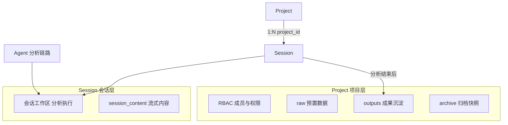
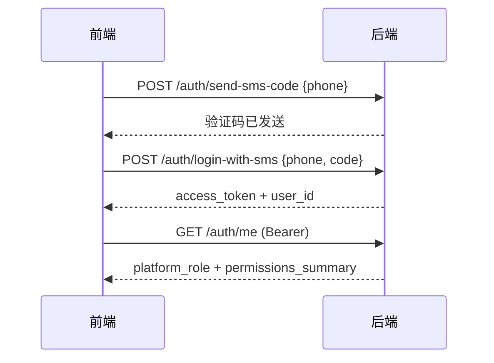
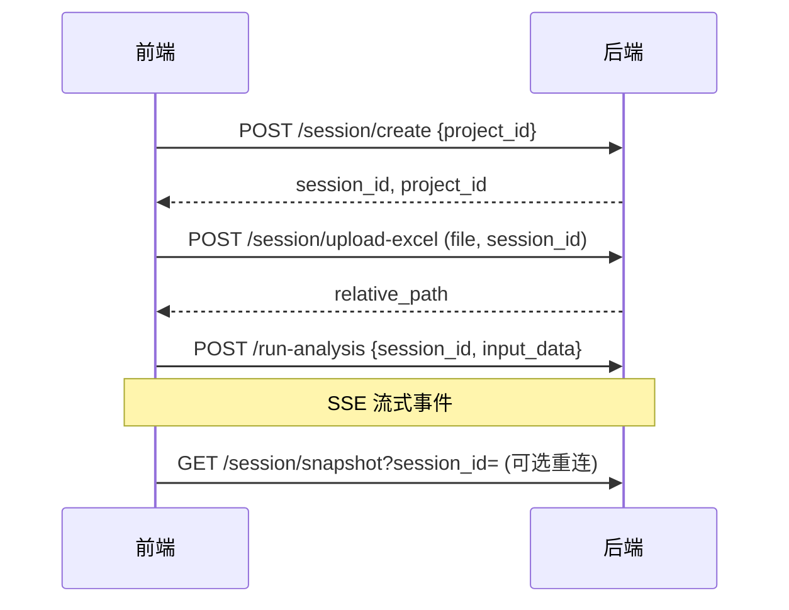
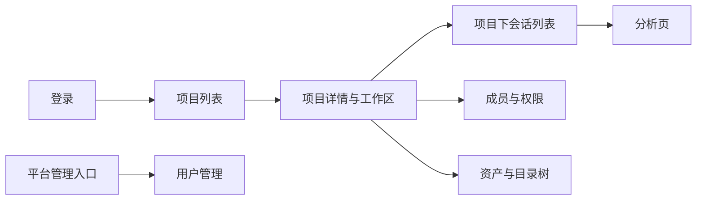

# 正式前端对接指南

> **读者**：产品前端开发（非 Streamlit 联调前端）。  
> **后端**：AgentPlatform FastAPI，默认 `http://<host>:52716`。  
> **联调前端**：`src/frontend/` 下的 Streamlit 页面仅供对照行为，**不是**对接规范。

本文档是产品前端对接的**主入口**：说明业务逻辑、推荐页面流程、权限与状态管理，并指向更详细的 API / 源码文档。

---

## 文档导航

| 文档 | 何时查阅 |
|------|----------|
| **本文档** | 理解项目/会话模型、页面流程、权限缓存、需求边界 |
| [`BackendAPI.md`](BackendAPI.md) | 接口路径、请求/响应字段、curl 示例 |
| [`RBAC.md`](RBAC.md) | 权限矩阵、访问规则细节 |
| [`AUTH.md`](AUTH.md) | JWT 登录、Bearer Token、Breaking Changes |
| [`TemplateAPI.md`](TemplateAPI.md) | 模板管理与模板分析 |
| [`ResourceAPI.md`](ResourceAPI.md) | 个人资源管理（文件空间 / 数据集 / 模型库） |
| [`PsychAPI.md`](PsychAPI.md) | 精神专科多维度分析 `/psych/*`（统计/ML/量表/LLM 等） |
| [`SSE_Details.md`](SSE_Details.md) | LLM 流式分析 SSE 事件类型 |
| [`MySQL.md`](MySQL.md) | 表结构与磁盘布局 |
| [`StartInstruction.md`](StartInstruction.md) | 本地启动与环境 |

---

## 1. 概述与需求映射（2.1.1）

本节将模块需求 **2.1.1 项目与权限管理** 映射到当前后端已实现能力与边界。

### 1.1 多项目智能化管理

**需求**：面向精神疾病等方向建立独立项目空间，覆盖创建、数据接入、处理分析、成果沉淀、归档等全生命周期。

**后端对应**：

| 生命周期阶段 | API / 能力 |
|--------------|------------|
| 项目创建 | `POST /project/create` |
| 项目列表/详情 | `GET /project/list`、`GET /project/{id}` |
| 数据接入 | 会话上传 `POST /session/upload-excel`；可选项目 `raw/` 预置 + `POST /session/copy-from-project-raw` |
| 处理分析 | `POST /run-analysis`（SSE）、`POST /analysis/template-run` |
| 成果沉淀 | 分析结束自动复制到 `outputs/<session_id>/` 并登记 `project_assets` |
| 目录浏览 | `GET /project/{id}/tree`、`GET /project/{id}/assets` |
| 归档管理 | `POST /project/{id}/archive`、`POST /project/{id}/restore` |

每个用户还有一个系统内置 **「个人默认」** 项目（内部名 `__personal_default__`）：未指定 `project_id` 创建会话时自动归入；不可归档、不可重命名、不可添加成员。

### 1.2 角色与权限管理

**需求**：管理员、项目负责人、普通用户；权限包括上传、删除、下载、标注、审核、统计分析、模型训练等。

**后端角色体系**：

| 层级 | 角色 | 字段/表 |
|------|------|---------|
| 平台 | `admin` / `user` | `users.platform_role` |
| 项目 | `project_manager` / `member` | `project_members.role` |
| 项目 | 所有者（创建者） | `projects.user_id`，自动拥有全部项目权限 |

**8 项操作权限码**（`project_members.permissions` 或 owner 全量）：

| 权限码 | 含义 |
|--------|------|
| `data_upload` | 数据上传 |
| `data_delete` | 数据删除 |
| `data_download` | 数据下载 |
| `data_annotate` | 数据标注 |
| `data_review` | 数据审核 |
| `analysis_create` | 统计分析任务创建 |
| `training_create` | 模型训练任务创建 |
| `member_manage` | 成员管理 |

平台管理员 API：`POST/GET/PUT /admin/users`（仅 `platform_role=admin`）。

### 1.3 多层级数据隔离

**需求**：项目级、患者级等多层级隔离，非授权用户不得查看数据。

**当前实现边界（请务必读清）**：

| 隔离层级 | 状态 | 机制 |
|----------|------|------|
| 用户/平台 | 已实现 | JWT + 封禁状态 |
| 项目 | 已实现 | 所有者 / 成员 / 权限码；非成员无法读项目资产、目录、他人会话 |
| 会话 | 已实现 | 创建者或所属项目成员；快照、工作区、分析均校验 |
| **患者/行级** | **未实现** | 无 Patient 实体；CSV 内 `patient_id` 列无行级 ACL API |

> **产品前端注意**：可在 UI 做患者维度展示或分组，但**不能依赖后端按患者授权**。患者级隔离需后续迭代。

### 1.4 项目共享与协同

**需求**：创建者共享课题，按角色分配差异化权限；被授权用户可查看、处理、分析、协作。

**后端对应**：

- `POST /project/{id}/members` 邀请（`user_id` 或 `phone` 二选一）
- `PUT/DELETE /project/{id}/members/{user_id}` 调整/移除
- `GET /session/list` 返回共享项目内他人创建的会话（`access: "shared"`）
- `GET /project/list` 共享项带 `is_shared: true`、`access`、`permissions`

**限制**：「个人默认」项目不支持成员管理，避免误共享私人数据。

---

## 2. 核心概念：项目 vs 会话

这是对接中最重要的逻辑主线。

### 2.1 职责划分



| 概念 | 含义 | 典型 API |
|------|------|----------|
| **Project** | 长期工作容器：RBAC、目录、资产、归档 | `/project/*` |
| **Session** | 一次分析/对话的执行单元：工作区、Runtime、流式内容 | `/session/*`、`/run-analysis` |

关系：**多对一** — 多个 Session 归属一个 Project（`session_user.project_id`）。

### 2.2 磁盘布局

```
workspaces/<user_id>/<project_id>/
├── raw/              # 项目级预置原始数据（可选）
├── processed/
├── outputs/          # 分析产出沉淀（按 session_id 分子目录）
├── archive/          # 归档快照
└── sessions/
    └── <session_id>/ # 会话工作区（Agent 实际读写）
```

- 新会话路径：`.../<project_id>/sessions/<session_id>/`（含个人默认项目）
- 历史 legacy：`workspaces/<user_id>/<session_id>/` 仍可读；迁移见 `scripts/migrate-legacy-sessions.sh`

权威路径以 DB 为准：`session_user.workspace_abs_path`、`projects.workspace_abs_path`。

### 2.3 前端必须遵守的三条规则

1. **权限权威来源是 `session.project_id`**  
   上传、分析等操作的 RBAC 以**当前会话所属项目**为准，不是 UI 上随便选中的项目 Tab。  
   切换会话后应调用 `GET /session/meta?session_id=` 同步 `sessionProjectId`（联调参考：`src/frontend/page_utils.py`）。

2. **分析只读会话工作区**  
   Agent 不会自动读取项目 `raw/`。数据进入分析的路径：
   - 推荐：`POST /session/upload-excel` 直接上传到会话
   - 或：先 `POST /project/{id}/upload` 写入 raw/，再 `POST /session/copy-from-project-raw`

3. **会话列表统一入口**  
   使用 `GET /session/list?project_id=`（可选过滤）；兼容接口 `GET /project/{id}/sessions` 仍可用。

---

## 3. 鉴权与全局状态

### 3.1 登录流程



**公开接口**（无需 Token）：`GET /health`、`POST /auth/send-sms-code`、`POST /auth/login-with-sms`

**后续所有业务请求**：

```http
Authorization: Bearer <access_token>
```

Token 配置见 [`AUTH.md`](AUTH.md)（`JWT_SECRET_KEY`、`JWT_EXPIRE_HOURS`）。

### 3.2 GET /auth/me — 权限缓存入口

登录成功后**建议立即调用**，用于驱动全局权限 UI。

**响应示例**（结构见 `src/backend/auth_service.py` → `build_me_response`）：

```json
{
  "code": 0,
  "msg": "ok",
  "data": {
    "user_id": 12,
    "username": "张三",
    "phone": "13800138000",
    "platform_role": "user",
    "permissions_summary": {
      "is_admin": false,
      "projects": {
        "1": {
          "access": "owner",
          "permissions": [
            "analysis_create",
            "data_annotate",
            "data_delete",
            "data_download",
            "data_review",
            "data_upload",
            "member_manage",
            "training_create"
          ]
        },
        "5": {
          "access": "member",
          "permissions": ["data_download", "analysis_create"]
        }
      }
    }
  }
}
```

平台管理员时：`permissions_summary.is_admin === true`，`projects` 可能为空对象（管理员绕过项目权限检查）。

### 3.3 建议的前端状态

| 状态键 | 来源 | 用途 |
|--------|------|------|
| `accessToken` | 登录响应 | 所有请求 Header |
| `userId`, `username`, `phone` | `/auth/me` | 展示 |
| `platformRole` | `/auth/me` | 是否显示「用户管理」等 admin 入口 |
| `permissionsSummary` | `/auth/me` | 项目列表页的权限预判 |
| `currentProjectId` | 用户选择 | **创建新会话**时的默认 `project_id` |
| `sessionId` | 用户选择/创建 | 上传、分析、快照 |
| `sessionProjectId` | `/session/meta` | **上传/分析按钮**权限判断（权威） |

### 3.4 权限判断伪代码

```javascript
const PERM = {
  UPLOAD: "data_upload",
  DELETE: "data_delete",
  DOWNLOAD: "data_download",
  ANNOTATE: "data_annotate",
  REVIEW: "data_review",
  ANALYSIS: "analysis_create",
  TRAINING: "training_create",
  MEMBER: "member_manage",
};

function isPlatformAdmin(me) {
  return me.platform_role === "admin" || me.permissions_summary?.is_admin;
}

function projectHasPermission(permissionsSummary, projectId, permission) {
  if (isPlatformAdmin({ platform_role: "user", permissions_summary: permissionsSummary })) {
    return true;
  }
  const proj = permissionsSummary?.projects?.[String(projectId)];
  if (!proj) return false;
  if (proj.access === "owner" || proj.access === "project_manager") return true;
  return (proj.permissions || []).includes(permission);
}

// 分析/上传：优先用 sessionProjectId，其次 currentProjectId
function canAnalyze(state) {
  const pid = state.sessionProjectId || state.currentProjectId;
  return projectHasPermission(state.permissionsSummary, pid, PERM.ANALYSIS);
}
```

联调前端完整实现：`src/frontend/page_utils.py`（`can_upload`、`can_analyze`、`sync_session_project_context` 等）。

### 3.5 安全边界

- UI 隐藏/禁用按钮仅为体验优化
- **后端 `src/backend/project_auth.py` 是最终安全边界**，必须处理 403
- 成员变更或角色变更后，应重新调用 `/auth/me` 刷新 `permissions_summary`

---

## 4. 页面/模块对接流程

### 4.1 项目列表与切换

**推荐页面**：项目列表 → 点击进入项目详情/工作区。

| 操作 | 方法 | 路径 | 说明 |
|------|------|------|------|
| 列表 | GET | `/project/list` | 含 `is_default`、`is_shared`、`access`、`permissions`、`session_count`、`status` |
| 详情 | GET | `/project/{id}` | 含 `subdirs`、`session_count`、当前用户 `access` |
| 创建 | POST | `/project/create` | body: `{"name":"抑郁队列研究"}`，不可用「个人默认」 |
| 重命名 | PUT | `/project/{id}` | body: `{"name":"新名称"}`，个人默认不可改 |
| 归档 | POST | `/project/{id}/archive` | 归档后禁止写操作（code=8） |
| 恢复 | POST | `/project/{id}/restore` | | |

**列表项展示建议**：

- `is_default === true` → 标注「个人默认」
- `is_shared === true` 或 `access !== 'owner'` → 标注「共享」
- `status === 'archived'` → 只读模式，禁用上传/分析/成员编辑

### 4.2 项目工作区（数据接入 / 成果 / 目录）

| 操作 | 方法 | 路径 | 权限 |
|------|------|------|------|
| 目录树 | GET | `/project/{id}/tree` | 项目读 |
| 资产列表 | GET | `/project/{id}/assets` | 项目读 |
| 预置 raw | POST | `/project/{id}/upload` | `data_upload`（响应含 deprecated 说明） |
| 下载 | GET | `/project/{id}/download?relative_path=raw/data.csv` | `data_download` |
| 删除资产 | DELETE | `/project/{id}/assets` | body: `{"relative_path":"..."}`，`data_delete` |

**推荐 UX — 数据接入主路径**：

```
创建会话 → 上传到会话工作区 → 发起分析
```

**可选路径 — 项目级预置库**：

```
上传到 project raw/ → 复制到会话 (copy-from-project-raw) → 发起分析
```

联调参考：`src/frontend/pages/project_workspace.py`

### 4.3 会话与分析任务

**推荐页面**：项目内「会话列表」→ 选中会话 → 「分析页」（上传 + 执行 + 结果展示）。

| 步骤 | 方法 | 路径 | 说明 |
|------|------|------|------|
| 创建会话 | POST | `/session/create` | body: `{"project_id": 1}`，省略则个人默认 |
| 列会话 | GET | `/session/list?project_id=1` | 含 `access`（owner/shared）、`project_id` |
| 同步上下文 | GET | `/session/meta?session_id=` | 切换会话时必调 |
| 保存标题 | POST | `/session/save-title` | body: `{session_id, title}`，仅首次写入 |
| 上传数据 | POST | `/session/upload-excel` | multipart: `file` + `session_id` |
| raw→会话 | POST | `/session/copy-from-project-raw` | body: `{session_id, relative_paths?}` |
| 工作区树 | GET | `/session/workspace-tree?session_id=` | |
| 内容快照 | GET | `/session/snapshot?session_id=` | 断线重连 |
| LLM 流式分析 | POST | `/run-analysis` | SSE，见 [`SSE_Details.md`](SSE_Details.md) |
| 断线恢复流 | POST | `/run-analysis/reconnect` | body: `{session_id}` |
| 模板分析 | POST | `/analysis/template-run` | 见 [`TemplateAPI.md`](TemplateAPI.md) |

**创建会话响应示例**：

```json
{
  "status": "success",
  "msg": "session created",
  "data": {
    "session_id": "9e9f3f2f-5978-4b31-a57f-95b0e6478b73",
    "user_id": 12,
    "project_id": 1,
    "workspace_abs_path": "/path/to/workspaces/12/1/sessions/9e9f3f2f-..."
  }
}
```

**完整分析流程（LLM）**：



### 4.4 成员管理与共享协同

| 操作 | 方法 | 路径 | 权限 |
|------|------|------|------|
| 按手机号找人 | GET | `/users/lookup?phone=13800138001` | 登录即可 |
| 成员列表 | GET | `/project/{id}/members` | 项目成员可读 |
| 添加成员 | POST | `/project/{id}/members` | `member_manage` |
| 更新成员 | PUT | `/project/{id}/members/{user_id}` | `member_manage` |
| 移除成员 | DELETE | `/project/{id}/members/{user_id}` | `member_manage` |

**添加成员请求体**（`src/backend/rbac_models.py` → `AddMemberRequest`）：

```json
{
  "phone": "13800138001",
  "role": "member",
  "permissions": ["data_download", "analysis_create", "data_upload"]
}
```

或使用 `"user_id": 20` 代替 `phone`（**二选一**）。

- `role: "project_manager"` → 自动拥有全部项目权限
- `role: "member"` 且 `permissions` 省略 → 默认仅 `data_download`

**共享会话 UI**：`GET /session/list` 中 `access === "shared"` 的项应标注「同事会话」或显示创建者信息（当前 API 不返回创建者姓名，可按需扩展或仅展示 session_id/title）。

联调参考：`src/frontend/pages/project_members.py`

### 4.5 平台管理员 — 用户管理

| 操作 | 方法 | 路径 |
|------|------|------|
| 创建用户 | POST | `/admin/users` |
| 用户列表 | GET | `/admin/users?offset=0&limit=50` |
| 用户详情 | GET | `/admin/users/{id}` |
| 更新用户 | PUT | `/admin/users/{id}` |

**创建用户 body**：

```json
{
  "username": "李四",
  "phone": "13900139000",
  "platform_role": "user",
  "status": "active"
}
```

仅 `platform_role === "admin"` 的用户可调用。联调参考：`src/frontend/pages/admin_users.py`

**初始管理员**：环境变量 `INITIAL_ADMIN_PHONE` 或 SQL 提升，见 [`RBAC.md`](RBAC.md) §7。

### 4.6 任务占位（标注 / 审核 / 训练）

| 操作 | 方法 | 路径 |
|------|------|------|
| 创建任务 | POST | `/project/{id}/tasks` |
| 任务列表 | GET | `/project/{id}/tasks` |
| 任务详情 | GET | `/project/{id}/tasks/{task_id}` |

**创建任务 body**：

```json
{
  "task_type": "annotate",
  "session_id": "optional-session-uuid",
  "payload": {}
}
```

`task_type` 与权限映射（`src/db/rbac_schema.py`）：

| task_type | 所需权限 |
|-----------|----------|
| `annotate` | `data_annotate` |
| `review` | `data_review` |
| `training` | `training_create` |
| `analysis` | `analysis_create` |

> 任务 API 当前为**登记占位**，用于权限校验与后续扩展；具体标注/训练 UI 由产品前端自行实现，完成后可更新任务状态（后续版本）。

---

## 5. 权限码与 UI 映射

| 权限码 | 中文 | 建议控制的 UI |
|--------|------|---------------|
| `data_upload` | 数据上传 | 会话上传、raw 复制、项目 raw 上传 |
| `data_delete` | 数据删除 | 资产删除按钮 |
| `data_download` | 数据下载 | 资产/文件下载 |
| `data_annotate` | 数据标注 | 标注任务创建 |
| `data_review` | 数据审核 | 审核任务创建 |
| `analysis_create` | 统计分析 | 流式分析、模板分析入口 |
| `training_create` | 模型训练 | 训练任务创建 |
| `member_manage` | 成员管理 | 邀请/改权限/移除成员 |

**项目生命周期**（重命名/归档/恢复）：owner、`project_manager` 或平台 admin（见 `can_manage_project`）。

---

## 6. 错误处理约定

### 6.1 响应格式

一般错误：

```json
{ "detail": "错误描述字符串" }
```

鉴权/权限错误（401/403）：

```json
{ "detail": { "code": 9, "msg": "forbidden: insufficient permission" } }
```

### 6.2 错误码与前端处理

| HTTP | code | 含义 | 前端建议 |
|------|------|------|----------|
| 401 | 6 | 未登录 / Token 无效或过期 | 清除本地 Token，跳转登录 |
| 403 | 3 | 用户已封禁 | 提示联系管理员 |
| 403 | 7 | 无项目或会话访问权 | 提示无权访问，返回列表 |
| 403 | 8 | 项目已归档 | 切换只读模式，禁用写操作 |
| 403 | 9 | 权限不足 | 提示缺少权限，可刷新 `/auth/me` |
| 404 | — | 资源不存在 | 提示并刷新列表 |
| 409 | — | 冲突（如手机号已注册、成员已存在） | 展示 detail |
| 415 | — | 文件类型不支持 | 上传组件校验扩展名 |
| 413 | — | 文件过大 | 提示大小限制（默认 2048MB） |

---

## 7. 推荐前端信息架构



**导航原则**：

1. **先选项目，再选会话** — 会话列表 scoped 到 `currentProjectId`
2. 切换会话 → 调 `/session/meta` 更新 `sessionProjectId`
3. 共享项目/共享会话 → 视觉标注（badge）
4. 归档项目 → 全局只读，仍可看 tree、assets、snapshot

**与联调 Streamlit 的对应关系**（仅供对照）：

| 产品页面（建议） | 联调参考文件 |
|------------------|--------------|
| 主控制台（项目+会话侧栏） | `src/frontend/app.py` |
| 流式分析 | `src/frontend/pages/streaming_analysis.py` |
| 模板分析 | `src/frontend/pages/template_analysis.py` |
| 项目工作区 | `src/frontend/pages/project_workspace.py` |
| 项目成员 | `src/frontend/pages/project_members.py` |
| 用户管理 | `src/frontend/pages/admin_users.py` |
| 权限工具函数 | `src/frontend/page_utils.py` |
| **个人资源管理**（文件/数据集/模型库） | `src/frontend/web/resources/` · 入口 `/resources/ui` · API 见 [`ResourceAPI.md`](ResourceAPI.md) |

### 7.1 个人资源管理（旁路能力）

与项目 RBAC 独立，按登录用户隔离：

| 页面模块 | 能力 | 主要 API 前缀 |
|----------|------|----------------|
| 文件空间 | 文件夹、上传/下载/预览/移动/删除、智能分类 | `/resources/files/*` |
| 数据集 | 元数据、预览、版本、归档 | `/resources/datasets/*` |
| 模型库 | 登记、下载、sklearn 在线预测 | `/resources/models/*` |

建议产品导航在「项目工作区」旁增加「我的资源」入口，指向上述三页或统一资源中心。

---

## 8. 联调与环境

### 8.1 启动后端

```bash
# 仓库根目录
bash scripts/init-platform.sh          # 首次：fixtures + 表 + 模板
bash scripts/start.sh                  # 后端 :52716
bash scripts/start.sh --with-frontend  # 可选：Streamlit 联调 :8501
curl http://localhost:52716/health
```

详见 [`StartInstruction.md`](StartInstruction.md)。

### 8.2 Base URL 与环境变量

| 项 | 值 |
|----|-----|
| API Base URL | `http://<host>:52716` |
| Content-Type | `application/json`（上传除外） |
| 生产 JWT | 必须设置 `JWT_SECRET_KEY` |

### 8.3 验收/联调快捷登录（仅开发）

```bash
bash scripts/init-platform.sh --acceptance
ACCEPTANCE_MODE=1 bash scripts/start.sh --with-frontend
```

Streamlit 侧栏可用 `13800000000` / `888888` 一键登录。**产品前端应实现正式短信登录流程**，不要依赖验收模式。

### 8.4 演示数据

`bash scripts/init-platform.sh` 后在 `tests/fixtures/` 有横截面/纵向样本 CSV，可用于上传测试。

---

## 9. 源码与文档索引

需要查实现细节时，按主题阅读：

| 主题 | 文件 |
|------|------|
| 路由注册总览 | `src/backend/route_registry.py` |
| 会话路由 | `src/backend/server.py` |
| 项目路由 | `src/backend/project_routes.py` |
| 成员/下载/任务 | `src/backend/member_routes.py` |
| 管理员 | `src/backend/admin_routes.py` |
| 模板 | `src/backend/template_routes.py` |
| 会话/分析业务 | `src/backend/route_services.py` |
| 项目业务 | `src/backend/project_service.py` |
| 权限计算 | `src/backend/permission_service.py` |
| 访问校验 | `src/backend/project_auth.py` |
| JWT | `src/backend/jwt_auth.py` |
| 登录/me | `src/backend/auth_service.py` |
| 请求体模型 | `src/backend/rbac_models.py`、`src/backend/api_models.py` |
| 会话存储/列表 | `src/db/session_store.py` |
| RBAC 表与常量 | `src/db/rbac_schema.py` |
| 项目表 | `src/db/project_schema.py`、`src/db/project_store.py` |
| 工作区路径 | `src/utils/workspace_manager.py` |
| 资产登记 | `src/backend/project_asset_registry.py` |
| 成果沉淀 | `src/backend/project_lifecycle.py` |

---

## 10. 附录：API 速查

> 字段与示例见 [`BackendAPI.md`](BackendAPI.md)。下表为权限要求摘要。

### 10.1 鉴权

| 方法 | 路径 | Token | 备注 |
|------|------|-------|------|
| POST | `/auth/send-sms-code` | 否 | |
| POST | `/auth/login-with-sms` | 否 | 返回 access_token |
| GET | `/auth/me` | 是 | 权限摘要 |
| POST | `/auth/update-username` | 是 | |

### 10.2 项目

| 方法 | 路径 | 权限 |
|------|------|------|
| POST | `/project/create` | 登录 |
| GET | `/project/list` | 登录 |
| GET | `/project/{id}` | 项目读 |
| PUT | `/project/{id}` | 项目管理 |
| GET | `/project/{id}/tree` | 项目读 |
| POST | `/project/{id}/archive` | 项目管理 |
| POST | `/project/{id}/restore` | 项目管理 |
| POST | `/project/{id}/upload` | data_upload |
| GET | `/project/{id}/assets` | 项目读 |
| GET | `/project/{id}/sessions` | 项目读 |
| GET | `/project/{id}/download` | data_download |
| DELETE | `/project/{id}/assets` | data_delete |

### 10.3 会话与分析

| 方法 | 路径 | 权限 |
|------|------|------|
| POST | `/session/create` | 项目读 + 未归档 |
| GET | `/session/list` | 登录 |
| GET | `/session/meta` | 会话访问 |
| POST | `/session/save-title` | 会话访问 |
| POST | `/session/upload-excel` | data_upload（按 session.project_id） |
| POST | `/session/copy-from-project-raw` | data_upload |
| GET | `/session/workspace-tree` | 会话访问 |
| GET | `/session/snapshot` | 会话访问 |
| POST | `/run-analysis` | analysis_create |
| POST | `/run-analysis/reconnect` | analysis_create |
| POST | `/analysis/template-run` | analysis_create |

### 10.4 成员与 admin

| 方法 | 路径 | 权限 |
|------|------|------|
| GET | `/users/lookup` | 登录 |
| GET/POST/PUT/DELETE | `/project/{id}/members` | 读/ member_manage |
| POST/GET/PUT | `/admin/users` | platform admin |
| POST/GET | `/project/{id}/tasks` | 按 task_type |

### 10.5 模板（摘要）

| 方法 | 路径 | 权限 |
|------|------|------|
| GET | `/template/list`、`/template/{id}` | 登录 |
| POST/PUT/DELETE | `/template/*` | platform admin |

完整说明见 [`TemplateAPI.md`](TemplateAPI.md)。

---

## 修订记录

| 日期 | 说明 |
|------|------|
| 2026-07 | 初版：项目/会话模型、RBAC、2.1.1 需求映射、产品前端对接流程 |
