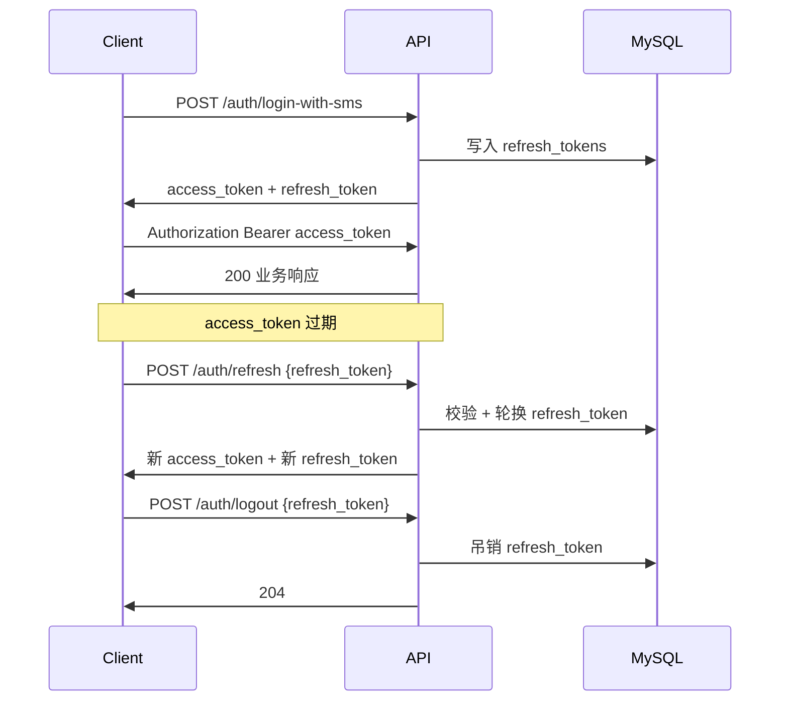
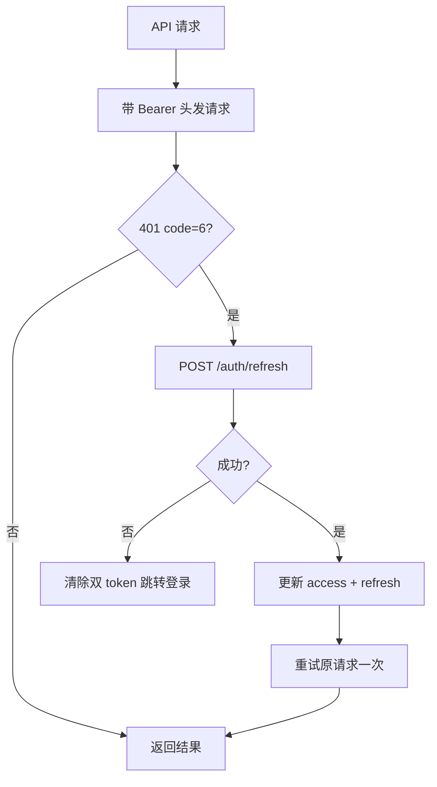

# 双 Token 鉴权方案

本文档描述 AgentPlatform 从**单 JWT** 升级为 **Access Token + Refresh Token** 双 token 鉴权的设计规划，与当前已落地的 [AUTH.md](AUTH.md)（单 token 现状）形成对照。

> **状态**：设计规划（尚未实现）。落地后需同步更新 [BackendAPI.md](BackendAPI.md) 与 [MySQL.md](MySQL.md)。

---

## 1. 现状与问题

### 1.1 当前实现（单 Token）

| 组件 | 位置 | 说明 |
|------|------|------|
| JWT 签发/解析 | [`src/backend/jwt_auth.py`](../src/backend/jwt_auth.py) | `create_access_token` / `decode_access_token` |
| 登录签发 | [`src/backend/auth_service.py`](../src/backend/auth_service.py) | `build_login_with_sms_response` 仅返回 `access_token` |
| 配置 | [`src/configs/config.py`](../src/configs/config.py) | `JWT_EXPIRE_HOURS=168`（7 天） |
| 前端存储 | [`src/frontend/frontend.py`](../src/frontend/frontend.py) | `st.session_state["access_token"]` |

登录成功后，客户端持有**同一枚 JWT** 访问所有受保护接口，直至自然过期。

### 1.2 单 Token 的局限

| 问题 | 影响 |
|------|------|
| 长寿命 Access Token（默认 7 天） | 泄露后攻击窗口大，无法快速失效 |
| 无服务端会话态 | 无法主动登出、无法踢人、无法「注销所有设备」 |
| SSE 长连接 | Access 过期后流式分析中途无法静默续期 |
| 无 Refresh 机制 | 客户端只能重新走短信登录 |

---

## 2. 设计目标

1. **缩短 Access Token 寿命**，降低 JWT 泄露风险
2. **Refresh Token 服务端可查**，支持登出、吊销、轮换
3. **业务 API 仍只认 Access Token**，保持无状态校验、不增加每次请求的 DB 开销
4. **与现有 MySQL 栈一致**，默认不引入 Redis
5. **与短信登录流程兼容**，在 `POST /auth/login-with-sms` 基础上扩展

---

## 3. 目标架构

采用业界标准的 **Access Token + Refresh Token** 双 token 模型。



### 3.1 Token 分工

| 类型 | 形式 | 有效期（建议默认） | 用途 | 客户端存储 | 服务端存储 |
|------|------|-------------------|------|-----------|-----------|
| **Access Token** | 短寿命 JWT（HS256） | **60 分钟** | 所有受保护 API 的 `Authorization: Bearer` | 内存 / session_state | 无（无状态） |
| **Refresh Token** | 不透明随机串（256 bit） | **7 天** | 仅用于 `/auth/refresh`、`/auth/logout` | 安全持久化 | MySQL `refresh_tokens` |

### 3.2 设计原则

- Access Token **保持无状态 JWT**，解析即可得到 `user_id`，不查库
- Refresh Token **必须服务端可查**，支持吊销与轮换（Rotation）
- Refresh Token **禁止**用于业务 API（`/session/*`、`/run-analysis/*` 等）
- 数据库**仅存 refresh token 的 SHA-256 哈希**，明文 token 只在签发/刷新时下发一次

### 3.3 存储选型

**默认推荐 MySQL**，与现有 [`users`](MySQL.md) / [`session_user`](MySQL.md) 表一致，无需新增基础设施。

| 方案 | 优点 | 缺点 | 适用 |
|------|------|------|------|
| **MySQL 表**（推荐） | 与现有栈一致；支持吊销、轮换、审计 | 每次 refresh 需查库 | 当前平台默认 |
| **Redis**（进阶） | TTL 自动过期；黑名单查询快 | 需新增依赖；持久化策略需额外设计 | 高并发、需 access token 即时黑名单 |

---

## 4. 数据模型

### 4.1 新增表 `refresh_tokens`

```sql
CREATE TABLE IF NOT EXISTS refresh_tokens (
    id BIGINT AUTO_INCREMENT PRIMARY KEY,
    token_hash VARCHAR(64) NOT NULL UNIQUE COMMENT 'refresh token SHA-256 哈希，不存明文',
    user_id BIGINT NOT NULL COMMENT '关联 users.id',
    expires_at TIMESTAMP NOT NULL COMMENT '过期时间',
    revoked_at TIMESTAMP NULL DEFAULT NULL COMMENT '吊销时间，非空即失效',
    replaced_by BIGINT NULL DEFAULT NULL COMMENT '轮换后指向新 token 记录 id',
    device_info VARCHAR(256) NULL COMMENT '可选：客户端标识',
    created_at TIMESTAMP DEFAULT CURRENT_TIMESTAMP,
    INDEX idx_user_id (user_id),
    INDEX idx_expires_at (expires_at)
) ENGINE=InnoDB DEFAULT CHARSET=utf8mb4 COMMENT 'Refresh Token 存储表';
```

**字段说明**：

- `token_hash`：对客户端收到的 refresh token 明文做 SHA-256，DB 泄露无法直接伪造
- `revoked_at`：登出或轮换时写入，非空即视为失效
- `replaced_by`：Refresh Token Rotation 时指向新记录，便于审计重放攻击
- `device_info`：可选，二期用于「我的登录设备」列表

### 4.2 代码扩展点

| 文件 | 变更 |
|------|------|
| [`src/db/models.py`](../src/db/models.py) | 新增 `TABLE_REFRESH_TOKENS`、`RefreshTokenRow`、DDL 常量 |
| 新建 `src/db/refresh_token_store.py` | `create` / `find_by_hash` / `revoke` / `revoke_all_for_user` / `rotate` |
| [`src/backend/jwt_auth.py`](../src/backend/jwt_auth.py) | 拆分 access 有效期配置；新增 refresh token 生成与哈希工具 |
| [`src/backend/auth_service.py`](../src/backend/auth_service.py) | 登录/refresh/logout 业务逻辑 |

---

## 5. API 变更

### 5.1 登录响应扩展

`POST /auth/login-with-sms` 成功时 `data` 扩展为：

```json
{
  "code": 0,
  "msg": "login success",
  "data": {
    "access_token": "eyJhbGciOiJIUzI1NiIs...",
    "refresh_token": "rt_a1b2c3d4e5f6...",
    "token_type": "bearer",
    "expires_in": 3600,
    "refresh_expires_in": 604800,
    "user_id": 12,
    "username": "张三",
    "phone": "13800138000"
  }
}
```

**Breaking 变更**：`expires_in` 语义由「7 天单 token」改为 **access token 短有效期（秒）**。

### 5.2 新增接口

| 接口 | 方法 | 鉴权 | 说明 |
|------|------|------|------|
| `/auth/refresh` | POST | 公开（body 带 `refresh_token`） | 校验 refresh → 轮换 → 返回新 token 对 |
| `/auth/logout` | POST | 公开（body 带 `refresh_token`） | 吊销当前 refresh token |
| `/auth/logout-all` | POST | Bearer access_token | 吊销该用户全部 refresh token（二期，可选） |

#### `POST /auth/refresh`

**请求**：

```json
{
  "refresh_token": "rt_a1b2c3d4e5f6..."
}
```

**成功响应（200）**：

```json
{
  "code": 0,
  "msg": "token refreshed",
  "data": {
    "access_token": "eyJhbGciOiJIUzI1NiIs...",
    "refresh_token": "rt_new...",
    "token_type": "bearer",
    "expires_in": 3600,
    "refresh_expires_in": 604800
  }
}
```

**实现逻辑**：

1. 对 `refresh_token` 做 SHA-256，查 `refresh_tokens` 表
2. 校验：存在、未过期、未吊销、用户未禁用
3. 若启用 Rotation：吊销旧 token，创建新 refresh 记录，返回新 token 对
4. 签发新 access token（从 DB 读取最新 `username` / `phone`）

#### `POST /auth/logout`

**请求**：

```json
{
  "refresh_token": "rt_a1b2c3d4e5f6..."
}
```

**成功响应**：`204 No Content` 或 `{ "code": 0, "msg": "logged out" }`

**实现逻辑**：将对应 `refresh_tokens` 记录的 `revoked_at` 设为当前时间。

### 5.3 现有接口（不变）

- 受保护业务接口仍只认 **Access Token**（`Authorization: Bearer`）
- `GET /auth/me`、`/session/*`、`/run-analysis/*` 等鉴权方式不变
- Refresh Token **不得**放入 `Authorization` 头访问业务接口

### 5.4 错误码扩展

| HTTP | code | msg | 场景 |
|------|------|-----|------|
| 401 | 6 | unauthorized | access token 无效/过期（客户端应尝试 refresh） |
| 401 | 8 | invalid_refresh_token | refresh token 无效、过期或已吊销 |
| 401 | 9 | refresh_token_reused | 检测到 refresh 重放（轮换策略触发，吊销该用户全部 refresh） |
| 403 | 3 | user is blocked | 用户被禁用时 refresh 拒绝 |

---

## 6. 配置项

| 环境变量 | 说明 | 建议默认 |
|---------|------|---------|
| `JWT_SECRET_KEY` | Access Token 签名密钥 | 生产必设 |
| `JWT_ACCESS_EXPIRE_MINUTES` | Access Token 有效期（分钟） | `60` |
| `JWT_REFRESH_EXPIRE_DAYS` | Refresh Token 有效期（天） | `7` |
| `JWT_REFRESH_ROTATION` | 是否启用 refresh 轮换（`1`/`0`） | `1` |

**迁移说明**：

- 现有 `JWT_EXPIRE_HOURS` 在双 token 落地后**废弃**
- 迁移期可保留 fallback：若未设置 `JWT_ACCESS_EXPIRE_MINUTES`，则读取 `JWT_EXPIRE_HOURS` 并打 deprecation warning

---

## 7. 客户端集成

### 7.1 存储

| Token | Streamlit 存储键 | 说明 |
|-------|-----------------|------|
| Access Token | `st.session_state["access_token"]` | 已有 |
| Refresh Token | `st.session_state["refresh_token"]` | 新增 |

### 7.2 自动 Refresh 流程



**改造要点**（[`src/frontend/frontend.py`](../src/frontend/frontend.py)）：

1. 登录成功后同时保存 `access_token` 与 `refresh_token`
2. 封装 `_request_with_auth()`：收到 401（code=6）时自动 refresh 并重试一次
3. SSE 流式接口（`/run-analysis`）：发起连接前检查 access 是否临近过期；reconnect 前先 refresh
4. 退出登录：调用 `POST /auth/logout` 并清除本地双 token

### 7.3 Refresh Token 传输方式

| 方式 | 适用 | 说明 |
|------|------|------|
| **JSON body**（默认） | Streamlit / httpx / 移动端 API | 与现有 `_auth_headers()` 模式一致，实现简单 |
| **HttpOnly Cookie**（可选） | 浏览器 SPA | `SameSite=Strict` + HTTPS；refresh 接口从 Cookie 读取，防 XSS 窃取 |

当前联调前端推荐 **JSON body**；若后续有独立 Web SPA，可在 `/auth/refresh` 同时支持 Cookie 读取。

---

## 8. 安全设计

### 8.1 Refresh Token Rotation

每次调用 `/auth/refresh`：

1. 校验旧 refresh token 有效
2. 立即将旧记录 `revoked_at` 设为当前时间
3. 创建新 refresh 记录，`replaced_by` 指向新 id
4. 返回新 access + refresh 对

若**已吊销的 refresh token 再次被使用**（重放攻击）：

- 返回 `401 code=9 refresh_token_reused`
- **吊销该用户全部 refresh token**，强制所有设备重新登录

### 8.2 哈希存储

```python
token_hash = hashlib.sha256(refresh_token_plain.encode()).hexdigest()
```

DB 不存明文；即使数据库泄露，攻击者无法直接构造有效 refresh 请求。

### 8.3 短 Access + 长 Refresh

- Access Token 默认 60 分钟：即使 JWT 泄露，窗口有限
- Refresh Token 7 天：用户无需频繁短信登录，但可通过 logout 立即失效

### 8.4 用户禁用联动

[`auth_service._is_user_blocked`](../src/backend/auth_service.py) 在 refresh 时同样生效；被禁用用户无法续期。

### 8.5 定时清理

建议 cron 任务（或应用内定时器）：

```sql
DELETE FROM refresh_tokens
WHERE expires_at < NOW() - INTERVAL 7 DAY;
```

清理过期且已吊销的记录，控制表体积。

### 8.6 进阶：Access Token 即时黑名单（可选）

若需「登出后 access token 立即失效」（而非等其自然过期）：

1. JWT payload 增加 `jti`（唯一 ID）
2. 登出时将 `jti` 写入 Redis 黑名单，TTL = access 剩余寿命
3. `get_current_user` 解析 JWT 后查黑名单

此方案需引入 Redis，作为二期增强，非双 token 默认路径。

---

## 9. 迁移计划

| 阶段 | 内容 | 兼容性 |
|------|------|--------|
| **Phase 0** | 发布本文档，评审 | — |
| **Phase 1** | 建表 + 登录双 token 下发 + `/auth/refresh` + `/auth/logout` | 旧客户端仍可用长 access（过渡期保留 `JWT_EXPIRE_HOURS` fallback） |
| **Phase 2** | 前端自动 refresh；缩短 access 默认有效期 | 旧客户端需升级以处理 refresh |
| **Phase 3** | 移除单 token 兼容；更新 [AUTH.md](AUTH.md) / [BackendAPI.md](BackendAPI.md) | Breaking |

### Phase 1 后端任务清单

- [ ] `refresh_tokens` 建表与 `RefreshTokenStore`
- [ ] `jwt_auth.py` 拆分 access / refresh 配置
- [ ] `build_login_with_sms_response` 同时签发双 token
- [ ] 新增 `build_refresh_response` / `build_logout_response`
- [ ] `server.py` 注册 `/auth/refresh`、`/auth/logout` 路由
- [ ] 扩展 `tests/test_auth.py`

### Phase 2 前端任务清单

- [ ] 保存 `refresh_token`
- [ ] `_request_with_auth()` 自动 refresh
- [ ] 退出登录调用 `/auth/logout`
- [ ] SSE 连接前 refresh 检查

---

## 10. 测试计划

扩展 [`tests/test_auth.py`](../tests/test_auth.py)：

| 用例 | 预期 |
|------|------|
| 登录返回 access + refresh | 200，双 token 非空 |
| refresh 成功 | 200，返回新 token 对；旧 refresh 已吊销 |
| 过期 refresh | 401 code=8 |
| 重放已吊销 refresh | 401 code=9；该用户全部 refresh 吊销 |
| logout 后 refresh | 401 code=8 |
| blocked 用户 refresh | 403 code=3 |
| 业务 API 带 refresh token 作 Bearer | 401 code=6 |

---

## 11. 与单 Token 方案对比

| 维度 | 单 Token（[AUTH.md](AUTH.md) 现状） | 双 Token（本方案） |
|------|-------------------------------------|-------------------|
| Access 有效期 | 7 天 | 60 分钟（可配置） |
| 登出 | 仅客户端清除 | 服务端吊销 refresh |
| Token 泄露窗口 | 最长 7 天 | Access 最长 60 分钟 |
| 服务端存储 | 无 | MySQL `refresh_tokens` |
| 新增接口 | — | `/auth/refresh`、`/auth/logout` |
| 客户端复杂度 | 低 | 中（需自动 refresh） |
| SSE 长连接 | 7 天内无需续期 | 超长分析需 refresh 策略 |

---

## 12. 相关文档

- [AUTH.md](AUTH.md) — 当前单 Token 鉴权（已落地）
- [BackendAPI.md](BackendAPI.md) — 接口契约（Phase 1 落地后更新）
- [MySQL.md](MySQL.md) — 数据库表说明（Phase 1 落地后补充 `refresh_tokens`）
