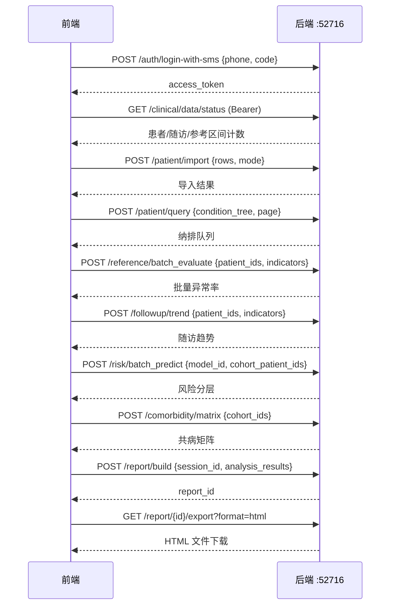
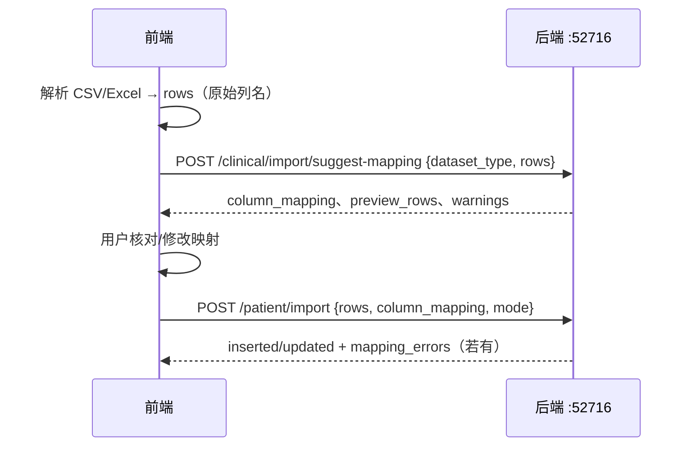

# 临床支持 API — 接口文档（给前端对接用）

> 2.1.6 临床支持已整合进 AgentPlatform 主框架。联调 UI 见 `src/frontend/app.py` 的「临床支持」页。**运行步骤见 §2**；正式产品前端请直接按本文档对接 HTTP 接口。
>
> 本文档覆盖 **患者纳排、参考区间、随访、风险预测、共病分析、图文报告、相关性分析** 接口；**列映射（LLM + 规则）** 见 §5.0.1、§5.0.2（新增，不改变 §5.1 起既有导入请求体）。
>
> **项目管理、RBAC、会话与鉴权** 见 [`2.1.1FrontendIntegrationGuide.md`](2.1.1FrontendIntegrationGuide.md)（产品前端主入口）；接口字段细节见 [`BackendAPI.md`](BackendAPI.md) 与 [`AUTH.md`](AUTH.md)。模板分析（2.1.5）见 [`TemplateAPI.md`](TemplateAPI.md)。完整环境搭建见 [`StartInstruction.md`](StartInstruction.md)。

---

## 1. 基本信息

| 项 | 值 |
|---|---|
| 服务 | FastAPI，与原平台、2.1.5 模板分析共用同一进程 |
| Base URL | `http://<host>:52716` |
| 数据格式 | 请求/响应均为 `application/json`（导出接口除外，见各节说明） |
| 鉴权方式 | JWT Bearer Token，登录后放在请求头 `Authorization: Bearer <access_token>` |
| 字符编码 | UTF-8 |

### 1.1 鉴权范围

| 接口分组 | 是否需要 Bearer Token | 附加要求 |
|---|---|---|
| `/auth/*` 登录相关 | 不需要（`/auth/me` 除外） | — |
| `/clinical/*`、`/patient/*`、`/reference/*`、`/followup/*`、`/risk/*`、`/comorbidity/*`、`/report/*`、`/correlation/*` | **需要** | 任意已登录用户 |

> 与 2.1.5 不同，临床接口目前**只校验登录态**，不绑定 `session_id` 归属（除图文报告 `POST /report/build` 需要传 `session_id` 用于归档）。数据读写走独立的临床库表（`mental_health_patients` 等），与会话工作区文件相互独立。

### 1.2 通用响应格式

成功响应统一为：

```json
{
  "status": "success",
  "data": { }
}
```

大多数错误是 `HTTPException`，形如：

```json
{ "detail": "错误信息字符串" }
```

鉴权失败（401 / 403）例外，`detail` 是对象：

```json
{ "detail": { "code": 6, "msg": "unauthorized" } }
```

| HTTP | 场景 |
|---|---|
| 400 | 参数缺失/校验失败（如 `condition_tree` 无效、训练样本不足） |
| 401 | 未带 token / token 失效 |
| 404 | 资源不存在（参考区间、报告、保存的查询条件等） |
| 500 | 服务端异常（数据库、模型训练内部错误） |

### 1.3 方法论证据字段

多数分析接口的 `data` 中会附带 `methodology` 对象（来自 `clinical_evidence` 注册表），用于前端展示方法学说明、文献引用与临床注意事项。结构示例：

```json
{
  "module": "reference_range",
  "method": "区间匹配与异常判定",
  "evidence": ["who_mental_health_2022"],
  "clinical_caveats": ["参考区间需结合人群来源复核", "..."]
}
```

可用 `GET /clinical/evidence?module=reference_range` 单独查询证据库。

---

## 2. 运行与联调

2.1.6 临床支持与 AgentPlatform 主框架、2.1.5 模板分析**共用同一后端进程和同一联调前端**，不需要单独启动 `2.1.6-clinical-fusion/` 目录下的历史脚本。

### 2.1 前置条件

| 项 | 要求 |
|---|---|
| MySQL | 已就绪（临床库表与会话数据均依赖 MySQL） |
| Conda 环境 | `agentPlatform`（`bash scripts/init-platform.sh` / `start.sh` 会自动激活） |
| 工作目录 | 在仓库根目录 `/path/to/AgentPlatform` 执行以下命令 |
| Cube Sandbox | **不需要**（临床模块不依赖 Cube；见 [`StartInstruction.md`](StartInstruction.md)） |

首次部署若未安装依赖：

```bash
conda create -n agentPlatform python=3.13.7
conda activate agentPlatform
python -m pip install -r requirements.txt
```

### 2.2 一键启动（推荐）

在仓库根目录依次执行：

```bash
# 1. 首次初始化：模板(2.1.5) + 临床演示数据(2.1.6) + fixtures
bash scripts/init-platform.sh --acceptance

# 2. 同时启动后端 + 联调前端（含流式分析 / 模板分析 / 临床支持）
ACCEPTANCE_MODE=1 bash scripts/start.sh --with-frontend

# 3. 确认服务正常
bash scripts/status.sh
curl http://127.0.0.1:52716/health
# 联调前端「临床支持」页或直接对接 HTTP 验收临床接口
```

### 2.3 端口与访问地址

| 服务 | 端口 | 地址 | 说明 |
|---|---|---|---|
| 后端 FastAPI | **52716** | `http://<host>:52716` | 主平台 + 2.1.5 + 2.1.6 全部 API |
| 联调前端 Streamlit | **8501** | `http://<host>:8501` | 多页导航，含「临床支持」页 |
| 健康检查 | 52716 | `GET /health` | 返回 `{"status":"healthy",...}` |

联调前端导航页：

| 页面 | 对应模块 |
|---|---|
| 流式分析 | AgentPlatform 主框架 |
| 模板分析 | 2.1.5 |
| **临床支持** | **2.1.6（本文档）** |
| 项目成员 / 用户管理 | 主框架 RBAC |

### 2.4 常用运维命令

```bash
bash scripts/start.sh                     # 仅启动后端
bash scripts/start.sh --with-frontend     # 后端 + 联调前端
bash scripts/status.sh                    # 查看进程与健康检查
bash scripts/stop.sh                      # 仅停后端
bash scripts/stop.sh --all                # 停后端 + 前端

# 日志
tail -f tmp/logs/backend.log
tail -f tmp/logs/frontend.log
```

`start.sh` 启动后会轮询 `/health`（最多 30s），通过后再提示「健康检查通过」。

### 2.5 仅重新导入临床演示数据

若只想刷新 2.1.6 种子数据、不重建模板：

```bash
python scripts/seed_216.py
```

`init-platform.sh` 已包含此步骤；单独执行适用于后端已在跑、只需重置患者/随访/参考区间/演示模型的场景。

### 2.6 验收登录

启用验收模式后，联调前端侧栏可用固定账号登录：

| 项 | 值 |
|---|---|
| 手机号 | `13800000000` |
| 验证码 | `888888` |
| 生效条件 | 启动时 `ACCEPTANCE_MODE=1`（见 §2.2 第 2 步） |

登录后拿到的 `access_token` 可用于本文档所有临床接口。

### 2.7 仅对接 HTTP、不用 Streamlit

正式产品前端只需对接 `http://<host>:52716`，**不必启动 8501 联调前端**：

```bash
bash scripts/init-platform.sh --acceptance
ACCEPTANCE_MODE=1 bash scripts/start.sh          # 不加 --with-frontend
curl http://127.0.0.1:52716/health               # 确认后端就绪后对接 HTTP
```

### 2.8 常见问题

| 现象 | 原因与处理 |
|---|---|
| `init-platform.sh` 报 `PermissionError`（workspace 目录） | 共享目录下文件属主不同；已修复为 `copyfile`，请拉最新代码后重跑；或 `sudo chgrp -R agent workspace && chmod -R g+rwX workspace` |
| `start.sh` 提示健康检查未通过 | 后端 conda 启动较慢，等几秒后 `bash scripts/status.sh` 再查；或看 `tmp/logs/backend.log` |
| 联调前端看不到「临床支持」页 | 前端进程是旧版本；`bash scripts/stop.sh --all` 后重新 `start.sh --with-frontend` |
| `POST /auth/login-with-sms` 验证码不对 | 未设 `ACCEPTANCE_MODE=1` 时 `888888` 无效，需真实短信或开启验收模式 |

更完整的环境说明见 [`StartInstruction.md`](StartInstruction.md)。

---

## 3. 典型对接流程



验收/联调可以跳过数据导入，直接复用 `seed_216.py` 写入的演示数据（见 §9.2）。

### 3.1 带列映射的导入流程（可选）

当用户上传的 CSV/Excel **列名非标准英文**（如「患者编号」「HAMD总分」）时，建议在导入前增加映射步骤：



> §3 主流程图保持不变；未使用映射时仍可直接 `POST /patient/import` 传标准字段行。

---

## 4. 前置接口（原平台已有，最小可用说明）

### 4.1 登录

```
POST /auth/send-sms-code
Content-Type: application/json

{ "phone": "13800000000" }
```

```
POST /auth/login-with-sms
Content-Type: application/json

{ "phone": "13800000000", "code": "888888" }
```

响应：

```json
{
  "code": 0,
  "msg": "login success",
  "data": {
    "access_token": "eyJhbGciOi...",
    "token_type": "bearer",
    "expires_in": 604800,
    "user_id": 2,
    "username": "user_0000_xxx",
    "phone": "13800000000"
  }
}
```

> 手机号 `13800000000` + 验证码 `888888` 是**验收专用固定账号**，只在后端环境变量 `ACCEPTANCE_MODE=1` 时生效。

之后所有临床请求带上：

```
Authorization: Bearer <access_token>
```

### 4.2 会话（仅图文报告需要）

`POST /report/build` 需要传 `session_id` 用于报告归档。可先调用：

```
POST /session/create
Authorization: Bearer <token>
```

获取 `session_id`。临床数据的导入与分析**不依赖**会话工作区文件。

---

## 5. 2.1.6 核心接口

### 5.0 数据状态与证据库

#### `GET /clinical/data/status`

判断临床库是否已有可分析数据。

响应 `data`：

```json
{
  "patients": 30,
  "followups": 120,
  "reference_ranges": 13,
  "ready": true
}
```

`ready=true` 表示患者表至少有 1 条记录。

#### `GET /clinical/evidence`

查询方法学证据库。

查询参数（均可选）：

| 参数 | 说明 |
|---|---|
| `module` | 模块名，如 `patient_query`、`reference_range`、`followup`、`risk_prediction`、`comorbidity`、`correlation` |
| `method` | 方法名过滤 |

---

### 5.0.1 列映射推断（新增）

#### `POST /clinical/import/suggest-mapping`

将用户上传表的**原始列名**映射到临床库**标准字段**（canonical field）。推断顺序：**中英文别名预匹配 → LLM（可配置）→ 规则补全**；LLM 不可用或失败时自动回退规则，不阻断接口。

**鉴权**：需要 Bearer Token（与导入接口相同）。

**请求体**：

```json
{
  "dataset_type": "patient",
  "rows": [
    {
      "受试者ID": "P301",
      "病人性别": "女",
      "病人年龄": 40,
      "主要疾病": "抑郁"
    },
    {
      "受试者ID": "P302",
      "病人性别": "男",
      "病人年龄": 55,
      "主要疾病": "焦虑"
    }
  ],
  "use_llm": true,
  "column_mapping": {}
}
```

| 字段 | 必填 | 说明 |
|---|---|---|
| `dataset_type` | 是 | 数据集类型，见下表；别名 `import_type` |
| `rows` | 是 | 原始行数组（建议传前 50 行用于推断）；别名 `sample_rows` |
| `use_llm` | 否 | 是否尝试 LLM，默认 `true`；无 API Key 时自动仅用规则 |
| `column_mapping` | 否 | 用户已选映射（canonical → 源列名），作为 `user_override` 与推断结果合并；别名 `user_override` |

**`dataset_type` 取值**：

| 值 | 别名 | 用途 |
|---|---|---|
| `patient` | `patients` | 患者主表导入 |
| `followup` | `followups` | 随访记录导入 |
| `reference` | `reference_range`、`reference_ranges` | 参考区间导入 |

**各类型标准字段（canonical）**：

| `dataset_type` | 必填字段 | 常见可选字段 |
|---|---|---|
| `patient` | `patient_id` | `age`、`gender`、`diagnosis`、`HAMD_total`、`HAMA_total`、`PHQ9_total`、`admission_date`、`discharge_date`、`disease_duration_years`、`medication`、`outcome`、`relapse` |
| `followup` | `patient_id`、`visit_date` | `visit_type`、`HAMD_total`、`HAMA_total`、`PHQ9_total`、`medication`、`medication_dose_mg`、`notes` |
| `reference` | `indicator`、`lower_bound`、`upper_bound` | `gender`、`diagnosis`、`age_range_lower`、`age_range_upper`、`unit`、`source` |

**响应 `data`**：

```json
{
  "dataset_type": "patient",
  "source_columns": ["受试者ID", "病人性别", "病人年龄", "主要疾病"],
  "column_mapping": {
    "patient_id": "受试者ID",
    "gender": "病人性别",
    "age": "病人年龄",
    "diagnosis": "主要疾病"
  },
  "required_fields": ["patient_id"],
  "optional_fields": ["age", "gender", "diagnosis", "HAMD_total", "..."],
  "missing_required": [],
  "unmapped_source_columns": [],
  "rationale": [
    "[manual] patient_id='受试者ID'",
    "[llm] diagnosis='主要疾病'"
  ],
  "mapping_source": "mixed",
  "llm_available": true,
  "llm_attempted": true,
  "llm_ok": true,
  "llm_error": null,
  "warnings": [],
  "preview_rows": [
    {
      "patient_id": "P301",
      "gender": "女",
      "age": 40,
      "diagnosis": "抑郁"
    }
  ],
  "ready_to_import": true
}
```

| 响应字段 | 说明 |
|---|---|
| `column_mapping` | 标准字段 → 上传文件列名（导入时原样回传） |
| `rationale` | 映射依据：`[manual]` 别名/用户指定、`[llm]` 大模型、`[rule_based]` 规则 |
| `mapping_source` | `manual` / `llm` / `rule_based` / `mixed` |
| `preview_rows` | 按当前映射转换后的前 5 行预览 |
| `ready_to_import` | `missing_required` 为空时为 `true` |
| `warnings` | 如「未配置 LLM，已使用规则映射」或「LLM 映射失败，已回退规则」 |

**LLM 配置**（仓库根目录 `.env`，后端启动时加载）：

| 变量 | 说明 |
|---|---|
| `OPENAI_API_KEY` 或 `API_KEY` | API 密钥 |
| `OPENAI_API_BASE` 或 `OPENAI_COMPATIBLE_API_BASE` | OpenAI 兼容网关地址 |
| `LLM_MODEL` | 映射所用模型（可选，默认读 `configs.config.DEFAULT_MODEL`） |

**错误示例**（HTTP 400）：

- `未知 dataset_type: xxx（支持 patient/followup/reference）`
- `无数据行，无法推断列映射`

---

### 5.0.2 导入接口可选参数：`column_mapping`（新增）

以下三个导入接口的**原有请求体不变**（§5.1 / §5.2 / §5.3 示例仍有效）。若需支持非标准列名，可**额外**传入 `column_mapping`（或别名 `mapping`）：

| 接口 | 说明 |
|---|---|
| `POST /patient/import` | 导入前将 `rows` 按映射转为标准字段再入库 |
| `POST /followup/import` | 同上 |
| `POST /reference/import` | 同上 |

**扩展请求示例**（在 §5.1 `POST /patient/import` 基础上增加映射字段）：

```json
{
  "rows": [
    {
      "受试者ID": "P301",
      "病人性别": "女",
      "病人年龄": 40,
      "主要疾病": "抑郁"
    }
  ],
  "column_mapping": {
    "patient_id": "受试者ID",
    "gender": "病人性别",
    "age": "病人年龄",
    "diagnosis": "主要疾病"
  },
  "mode": "upsert"
}
```

| 字段 | 必填 | 说明 |
|---|---|---|
| `rows` | 是 | **原始**行（键为上传文件列名）；与各节已有的 `patients` / `records` / `ranges` 别名仍兼容 |
| `column_mapping` | 否 | 标准字段 → 源列名；省略时行为与文档原描述一致（行内键须已是标准字段名） |
| `mode` | 否 | 同原接口：`upsert`（默认）/ `append_only` |

**响应扩展**：当服务端映射有个别行失败时，`data` 中可能附带 `mapping_errors`（字符串数组，最多 10 条），`inserted` / `updated` / `skipped` 字段含义不变。

**推荐对接顺序**：

1. 前端解析文件 → `rows`
2. `POST /clinical/import/suggest-mapping` 获取建议映射与 `preview_rows`
3. 用户确认或修改 `column_mapping`
4. 调用对应 `POST /*/import`，同时传 `rows`（原始列名）+ `column_mapping`

---

### 5.1 患者检索与纳排（N2_1）

#### 条件树 `condition_tree` 格式

支持嵌套逻辑与叶子条件：

```json
{
  "operator": "AND",
  "conditions": [
    { "field": "diagnosis", "op": "IN", "value": ["depression", "anxiety"] },
    { "field": "age", "op": ">=", "value": 18 },
    {
      "operator": "OR",
      "conditions": [
        { "field": "HAMD_total", "op": ">", "value": 17 },
        { "field": "relapse", "op": "=", "value": 1 }
      ]
    }
  ]
}
```

叶子条件字段：

| 字段 | 说明 |
|---|---|
| `field` | 患者表字段，白名单见下表 |
| `op` | `=`、`!=`、`>`、`<`、`>=`、`<=`、`IN`、`NOT IN`、`LIKE`、`BETWEEN` |
| `value` | 标量或数组（`IN`/`NOT IN`/`BETWEEN`） |

可用 `field` 白名单：

```
patient_id, age, gender, diagnosis,
admission_date, discharge_date,
HAMD_total, HAMA_total, PHQ9_total,
disease_duration_years,
medication, outcome, relapse
```

#### `POST /patient/query`

分页查询患者。

```json
{
  "condition_tree": {
    "operator": "AND",
    "conditions": [
      { "field": "diagnosis", "op": "IN", "value": ["depression"] }
    ]
  },
  "page": 1,
  "page_size": 20
}
```

响应 `data`：

```json
{
  "patients": [
    {
      "id": 1,
      "patient_id": "P001",
      "age": 45,
      "gender": "female",
      "diagnosis": "depression",
      "HAMD_total": 22.0,
      "HAMA_total": 18.0,
      "PHQ9_total": 16.0,
      "relapse": 0
    }
  ],
  "total": 12,
  "page": 1,
  "page_size": 20,
  "methodology": { }
}
```

#### `POST /patient/import`

导入患者主表（CSV/Excel 解析后由前端转成 JSON 行数组）。

```json
{
  "rows": [
    {
      "patient_id": "P031",
      "age": 28,
      "gender": "male",
      "diagnosis": "anxiety",
      "HAMD_total": 12,
      "HAMA_total": 20,
      "PHQ9_total": 11,
      "relapse": 0
    }
  ],
  "mode": "upsert"
}
```

| `mode` | 说明 |
|---|---|
| `upsert` | 按 `patient_id` 存在则更新，否则插入（默认） |
| `append_only` | 仅插入新 `patient_id`，已存在则跳过 |

响应 `data`：`{ "inserted": 1, "updated": 0, "skipped": 0, "errors": [] }`

> 也接受 `patients` 作为行数组字段名（与 `rows` 等价）。

#### `POST /patient/query/save` / `GET /patient/query/list` / `GET /patient/query/{query_id}`

保存、列出、读取当前用户保存的纳排条件。

保存请求：

```json
{
  "query_name": "抑郁成人队列",
  "condition_tree": { "operator": "AND", "conditions": [ ] }
}
```

#### `POST /patient/query/export`

按条件树导出患者列表，返回文件下载（非 JSON）。

```json
{
  "condition_tree": { "operator": "AND", "conditions": [ ] },
  "format": "csv"
}
```

`format`：`csv`（默认）或 `xlsx`。

---

### 5.2 参考区间与异常评估（N2_2）

#### `GET /reference/list`

列出全部参考区间配置。

#### `POST /reference/create`

```json
{
  "indicator": "HAMD_total",
  "lower_bound": 0,
  "upper_bound": 7,
  "gender": null,
  "age_range_lower": 18,
  "age_range_upper": 65,
  "diagnosis": "depression",
  "unit": "分",
  "source": "指南/文献"
}
```

#### `POST /reference/import`

批量导入参考区间。

```json
{
  "rows": [
    {
      "indicator": "HAMA_total",
      "lower_bound": 0,
      "upper_bound": 7,
      "diagnosis": "anxiety"
    }
  ],
  "mode": "upsert"
}
```

#### `GET /reference/{ref_id}` / `PUT /reference/{ref_id}` / `DELETE /reference/{ref_id}`

单条查询、更新、删除。

#### `POST /reference/evaluate`

对单个患者的指标字典做异常判定。

```json
{
  "indicators": { "HAMD_total": 22, "HAMA_total": 15 },
  "gender": "female",
  "age": 45,
  "diagnosis": "depression"
}
```

响应 `data` 为数组，每项含 `indicator`、`value`、`lower_bound`、`upper_bound`、`is_abnormal`、`matched_range_id` 等。

#### `POST /reference/batch_evaluate`

对一组患者批量计算异常率（核心接口）。

```json
{
  "patient_ids": ["P001", "P002", "P003"],
  "indicators": ["HAMD_total", "HAMA_total", "PHQ9_total"]
}
```

`patient_ids` 为空时，评估库内最多 500 名患者。

响应 `data`：

```json
{
  "abnormal_rates": { "HAMD_total": 85.0, "HAMA_total": 60.0 },
  "details": [
    {
      "patient_id": "P001",
      "results": [
        { "indicator": "HAMD_total", "value": 22, "is_abnormal": true }
      ]
    }
  ],
  "total_patients": 3,
  "evaluated_patients": 3,
  "interpretation_note": "异常率 = 量表得分超出已配置参考区间上/下限的患者比例...",
  "methodology": { }
}
```

#### `POST /reference/compare`

队列与参考人群横向对比。

```json
{
  "cohort_patient_ids": ["P001", "P002"],
  "reference_cohort_ids": ["P010", "P011"],
  "indicators": ["HAMD_total"]
}
```

也支持单指标写法：`"indicator": "HAMD_total"`（会自动转为数组）。

---

### 5.3 随访管理（N2_3）

#### `POST /followup/add`

```json
{
  "patient_id": "P001",
  "visit_date": "2026-01-15",
  "visit_type": "week4",
  "HAMD_total": 18,
  "HAMA_total": 12,
  "PHQ9_total": 10,
  "medication": "SSRI",
  "notes": "症状改善"
}
```

#### `POST /followup/import`

```json
{
  "rows": [
    {
      "patient_id": "P001",
      "visit_date": "2026-02-01",
      "HAMD_total": 15
    }
  ],
  "mode": "upsert"
}
```

#### `POST /followup/query`

```json
{
  "patient_ids": ["P001", "P002"],
  "indicators": ["HAMD_total", "HAMA_total"],
  "start_date": "2025-01-01",
  "end_date": "2026-12-31"
}
```

时间窗也可用预设字段（与 `start_date`/`end_date` 二选一或组合）：

| 字段 | 说明 |
|---|---|
| `time_window` / `visit_type` | `baseline`、`week4`、`week8`、`week12`、`custom`、`all` |
| `anchor_date` | 预设窗锚点日期（如 `week4` 需要） |
| `time_range` | `["2025-01-01", "2026-06-30"]` 自定义区间 |

响应 `data`：`{ "P001": [ { "visit_date": "...", "HAMD_total": 18, ... } ], ... }`

#### `POST /followup/trend`

生成趋势图数据。

```json
{
  "patient_ids": ["P001", "P002"],
  "indicators": ["HAMD_total", "PHQ9_total"],
  "per_patient": true,
  "time_window": "all"
}
```

#### `POST /followup/compare`

两组患者随访指标对比。

```json
{
  "group_a": ["P001", "P002"],
  "group_b": ["P003", "P004"],
  "indicators": ["HAMD_total"],
  "time_window": "week12",
  "anchor_date": "2025-06-01"
}
```

---

### 5.4 风险预测（N2_4）

#### `POST /risk/train`

训练模型（同步接口，样本量大时请把超时设到 60s 以上）。

**推荐写法（service 格式）：**

```json
{
  "task_type": "relapse",
  "model_type": "RandomForest",
  "features": ["HAMD_total", "HAMA_total", "PHQ9_total", "age"],
  "label": "relapse",
  "training_data": [
    { "HAMD_total": 22, "HAMA_total": 18, "PHQ9_total": 15, "age": 45, "relapse": 1 }
  ],
  "model_params": { "n_estimators": 100 }
}
```

**兼容写法（矩阵格式，后端自动转换）：**

```json
{
  "task": "relapse",
  "features": ["HAMD_total", "HAMA_total", "age"],
  "target": "relapse",
  "X": [[22, 18, 45], [12, 10, 32]],
  "y": [1, 0]
}
```

| 字段 | 说明 |
|---|---|
| `task_type` / `task` | `relapse`（复发）、`self_harm`（自伤）、`adverse_reaction`（不良反应） |
| `model_type` | `RandomForest`（默认）或 `LogisticRegression` |
| `training_data` | 至少 **20 条** |
| `label` / `target` | 二分类标签字段名，默认 `relapse` |

响应 `data`：`{ "model_id": 1, "metrics": { "accuracy": 0.85, "auc": 0.78, ... }, "features": [...] }`

#### `GET /risk/models`

列出已保存模型。可选查询参数 `task_type=relapse`。

#### `GET /risk/model/{model_id}/evaluate`

返回模型评估指标、混淆矩阵、ROC 曲线数据等。

#### `POST /risk/predict`

单患者预测。

```json
{
  "model_id": 1,
  "patient_data": {
    "HAMD_total": 20,
    "HAMA_total": 16,
    "PHQ9_total": 14,
    "age": 40
  }
}
```

也接受 `input_data` 作为 `patient_data` 别名。

响应 `data` 含 `risk_score`（0~1）、`risk_level`（`low`/`medium`/`high`/`critical`）、`feature_contributions` 等。

> `risk_level` 为工程分层阈值，**仅供研究/辅助分诊参考**，不得作为临床处置唯一依据。

#### `POST /risk/batch_predict`

对队列批量预测（从患者表拉取特征列）。

```json
{
  "model_id": 1,
  "cohort_patient_ids": ["P001", "P002", "P003"]
}
```

---

### 5.5 共病分析（N2_5）

共病诊断集 = 患者 `diagnosis` 主诊断 + 量表阈值推断的伴发信号（HAMA≥15、HAMD≥17、PHQ9≥15 等），**不是正式共病诊断**。

#### `POST /comorbidity/matrix`

```json
{
  "cohort_ids": ["P001", "P002", "P003", "P004"]
}
```

响应 `data`：

```json
{
  "diagnoses": ["depression", "anxiety", "sleep_disorder"],
  "frequency_matrix": { "depression": { "anxiety": 5, "sleep_disorder": 2 } },
  "cooccurrence_rate": { "depression": { "anxiety": 0.625 } },
  "total_patients": 8,
  "diagnosis_counts": { "depression": 6, "anxiety": 4 },
  "inference_note": "共病集含主诊断 + 量表阈值推断的伴发症状信号...",
  "methodology": { }
}
```

#### `POST /comorbidity/spectrum`

谱系关系分析。

```json
{
  "cohort_ids": ["P001", "P002"],
  "primary_diagnosis": "depression"
}
```

`primary_diagnosis` 可省略，后端从队列主诊断众数自动推断。

#### `POST /comorbidity/cluster`

```json
{
  "cohort_ids": ["P001", "P002", "P003"],
  "n_clusters": 3
}
```

#### `POST /comorbidity/heatmap` / `POST /comorbidity/network`

可直接传矩阵，或传 `cohort_ids` 由后端先算矩阵再生成可视化 payload。

热图请求（可选传现成矩阵）：

```json
{
  "cohort_ids": ["P001", "P002", "P003"]
}
```

网络图同理；也可直接传 `edges` / `nodes`。

#### `POST /comorbidity/analyze`

一站式分析入口（按 `analysis_type` 分发）。

```json
{
  "analysis_type": "共病矩阵",
  "cohort_ids": ["P001", "P002"],
  "primary_diagnosis": "depression"
}
```

---

### 5.6 图文报告（N2_6）

#### `POST /report/build`

构建结构化报告并可选 LLM 润色（`OPENAI_API_KEY` 未配置时自动走规则模板）。

```json
{
  "session_id": "acceptance-demo-session",
  "template_id": 1,
  "cohort_patient_ids": ["P001", "P002", "P003"],
  "auto_aggregate": true,
  "use_llm": true,
  "analysis_results": {
    "检索纳排": "纳入抑郁成人 12 例",
    "异常评估": "HAMD 异常率 85%"
  }
}
```

| 字段 | 说明 |
|---|---|
| `session_id` | 必填，用于报告归档 |
| `analysis_results` | 各章节原始摘要；`auto_aggregate=true` 时后端会补充共病/随访等自动汇总 |
| `use_llm` | 默认 `true`；无 API Key 时静默降级为规则文本 |
| `cohort_patient_ids` / `cohort_ids` | 自动汇总用的患者队列 |

响应 `data`：`{ "report_id": 1, "title": "...", "sections": { } }`

#### `GET /report/list`

列出当前用户已生成的报告。

#### `GET /report/{report_id}/export?format=html`

导出报告文件。`format` 支持 `html`（默认）；若环境支持 PDF 生成则可用 `pdf`。

响应为文件下载（`Content-Disposition` 附件），不是 JSON。

---

### 5.7 相关性分析（N2_7）

#### `POST /correlation/compute`

```json
{
  "data": [
    { "HAMD_total": 22, "HAMA_total": 18, "PHQ9_total": 15, "age": 45 },
    { "HAMD_total": 12, "HAMA_total": 10, "PHQ9_total": 8, "age": 32 }
  ],
  "columns": ["HAMD_total", "HAMA_total", "PHQ9_total"],
  "method": "pearson"
}
```

`method`：`pearson`（默认）、`spearman`、`kendall`。至少 **3 条**记录、**2 个**指标。

响应 `data`：

```json
{
  "matrix": [[1.0, 0.65, 0.58], [0.65, 1.0, 0.42], [0.58, 0.42, 1.0]],
  "p_values": [[null, 0.01, 0.03], [0.01, null, 0.08], [0.03, 0.08, null]],
  "labels": ["HAMD_total", "HAMA_total", "PHQ9_total"],
  "method": "pearson",
  "sample_size": 30,
  "methodology": { }
}
```

> 前端也可先从 `POST /patient/query` 拿到患者列表，提取数值列组装 `data` 再调用本接口。

#### `POST /correlation/partial`

偏相关（控制混杂变量）。至少 **5 条**记录。

```json
{
  "data": [ ],
  "columns": ["HAMD_total", "PHQ9_total"],
  "control_vars": ["age"]
}
```

也接受 `controls` 作为 `control_vars` 别名。

#### `POST /correlation/heatmap`

可由 `data`+`columns` 现算矩阵，或直接传 `matrix`/`labels`/`p_values` 生成热图渲染数据。

#### `POST /correlation/significant_pairs`

筛选显著相关对。

```json
{
  "data": [ ],
  "columns": ["HAMD_total", "HAMA_total", "PHQ9_total"],
  "method": "pearson",
  "min_abs_r": 0.3,
  "p_threshold": 0.05,
  "correction": "fdr_bh"
}
```

---

## 6. 接口一览表

| 模块 | 方法 | 路径 | 说明 |
|---|---|---|---|
| 状态 | GET | `/clinical/data/status` | 临床库记录数 |
| 证据 | GET | `/clinical/evidence` | 方法学证据库 |
| 列映射 | POST | `/clinical/import/suggest-mapping` | LLM/规则推断导入列映射（§5.0.1） |
| 纳排 | POST | `/patient/query` | 条件树查询 |
| 纳排 | POST | `/patient/import` | 导入患者 |
| 纳排 | POST | `/patient/query/save` | 保存条件 |
| 纳排 | GET | `/patient/query/list` | 列出已保存条件 |
| 纳排 | GET | `/patient/query/{id}` | 读取已保存条件 |
| 纳排 | POST | `/patient/query/export` | 导出 CSV/XLSX |
| 参考区间 | GET | `/reference/list` | 列表 |
| 参考区间 | POST | `/reference/create` | 创建 |
| 参考区间 | POST | `/reference/import` | 批量导入 |
| 参考区间 | GET/PUT/DELETE | `/reference/{id}` | 单条 CRUD |
| 参考区间 | POST | `/reference/evaluate` | 单人异常评估 |
| 参考区间 | POST | `/reference/batch_evaluate` | 批量异常率 |
| 参考区间 | POST | `/reference/compare` | 队列对比 |
| 随访 | POST | `/followup/add` | 新增记录 |
| 随访 | POST | `/followup/import` | 批量导入 |
| 随访 | POST | `/followup/query` | 查询记录 |
| 随访 | POST | `/followup/trend` | 趋势数据 |
| 随访 | POST | `/followup/compare` | 组间对比 |
| 风险 | POST | `/risk/train` | 训练模型 |
| 风险 | POST | `/risk/predict` | 单人预测 |
| 风险 | POST | `/risk/batch_predict` | 批量预测 |
| 风险 | GET | `/risk/models` | 模型列表 |
| 风险 | GET | `/risk/model/{id}/evaluate` | 模型评估 |
| 共病 | POST | `/comorbidity/matrix` | 共病矩阵 |
| 共病 | POST | `/comorbidity/spectrum` | 谱系关系 |
| 共病 | POST | `/comorbidity/cluster` | 聚类 |
| 共病 | POST | `/comorbidity/heatmap` | 热图数据 |
| 共病 | POST | `/comorbidity/network` | 网络图数据 |
| 共病 | POST | `/comorbidity/analyze` | 一站式分析 |
| 报告 | POST | `/report/build` | 生成报告 |
| 报告 | GET | `/report/list` | 报告列表 |
| 报告 | GET | `/report/{id}/export` | 导出 HTML/PDF |
| 相关 | POST | `/correlation/compute` | 相关矩阵 |
| 相关 | POST | `/correlation/partial` | 偏相关 |
| 相关 | POST | `/correlation/heatmap` | 相关热图 |
| 相关 | POST | `/correlation/significant_pairs` | 显著相关对 |

---

## 7. 前端接入注意事项

### 7.1 数据模型与导入

- 临床分析读的是 **MySQL 临床库表**，不是会话工作区里的 Excel 文件。正式对接流程应是：前端解析 CSV/Excel → `POST /patient/import`、`POST /followup/import`、`POST /reference/import`。
- **非标准列名**：先 `POST /clinical/import/suggest-mapping`，用户确认 `column_mapping` 后，再调用导入接口（见 §5.0.1、§5.0.2）；不传 `column_mapping` 时行为与原文档一致。
- 导入接口的 `mode` 建议默认 `upsert`；仅追加新患者时用 `append_only`。
- 患者 `gender` 建议统一为 `male` / `female`（种子数据兼容 `M`/`F`）。

### 7.2 同步 vs 异步

以下接口为**同步阻塞**，请设置合理超时与 loading 态：

| 接口 | 典型耗时 |
|---|---|
| `POST /risk/train` | 数秒（取决于样本量） |
| `POST /report/build`（`use_llm=true`） | 数秒~十几秒（取决于 LLM） |
| `POST /comorbidity/cluster` | 取决于队列大小 |
| `POST /clinical/import/suggest-mapping`（`use_llm=true`） | 通常 1–5s（取决于 LLM 网关） |

其余查询/评估接口通常在 1s 内。

### 7.3 临床免责声明

- 风险预测的 `risk_level`、共病的量表阈值推断、参考区间异常率等，均为**决策辅助/科研分析**输出，需在前端展示方法学说明与复核提示（可读取 `methodology` 字段）。
- 报告页脚已含「须经负责人复核后使用」声明，产品 UI 建议保留同等提示。

### 7.4 与 2.1.5 的关系

- **2.1.5**：会话工作区文件 + 模板算子流水线（`/template/*`、`/analysis/template-run`）
- **2.1.6**：临床库表 + 纳排/随访/风险/共病/报告（本文档接口）
- 两者共用同一后端端口 **52716**，登录 token 通用，可同时对接。

### 7.5 列映射（LLM + 规则）

- 推断接口：`POST /clinical/import/suggest-mapping`（§5.0.1）。
- 导入时可选传 `column_mapping`，服务端在写库前将原始 `rows` 转为标准字段（§5.0.2）；**不改变** §5.1–§5.3 原有字段与 `mode` 语义。
- 前端建议展示：`column_mapping` 可编辑下拉、`preview_rows` 预览、`rationale` 折叠说明、`warnings` 提示。
- `use_llm=false` 可强制仅规则/别名映射（用于离线或验收环境）。
- 重新推断：再次调用 `suggest-mapping`，可将用户修改后的映射放入 `column_mapping` / `user_override`。

---

## 8. 最小可运行示例（JavaScript / fetch）

```js
const BASE = "http://<host>:52716";

async function loginAndClinicalDemo() {
  // 1. 登录
  const loginRes = await fetch(`${BASE}/auth/login-with-sms`, {
    method: "POST",
    headers: { "Content-Type": "application/json" },
    body: JSON.stringify({ phone: "13800000000", code: "888888" }),
  }).then((r) => r.json());
  const token = loginRes.data.access_token;
  const authHeaders = {
    Authorization: `Bearer ${token}`,
    "Content-Type": "application/json",
  };

  // 2. 数据状态
  const status = await fetch(`${BASE}/clinical/data/status`, {
    headers: authHeaders,
  }).then((r) => r.json());
  console.log("clinical status", status.data);

  // 3. 纳排查询
  const cohort = await fetch(`${BASE}/patient/query`, {
    method: "POST",
    headers: authHeaders,
    body: JSON.stringify({
      condition_tree: {
        operator: "AND",
        conditions: [{ field: "diagnosis", op: "IN", value: ["depression"] }],
      },
      page: 1,
      page_size: 10,
    }),
  }).then((r) => r.json());
  const patientIds = cohort.data.patients.map((p) => p.patient_id);

  // 4. 批量异常率
  const abnorm = await fetch(`${BASE}/reference/batch_evaluate`, {
    method: "POST",
    headers: authHeaders,
    body: JSON.stringify({
      patient_ids: patientIds.slice(0, 5),
      indicators: ["HAMD_total", "HAMA_total"],
    }),
  }).then((r) => r.json());
  console.log("abnormal rates", abnorm.data.abnormal_rates);

  // 5. 共病矩阵
  const comorb = await fetch(`${BASE}/comorbidity/matrix`, {
    method: "POST",
    headers: authHeaders,
    body: JSON.stringify({ cohort_ids: patientIds.slice(0, 8) }),
  }).then((r) => r.json());
  console.log("comorbidity", comorb.data.diagnoses, comorb.data.cooccurrence_rate);

  // 6. 风险批量预测（需先 seed 或 train 出模型）
  const models = await fetch(`${BASE}/risk/models`, {
    headers: authHeaders,
  }).then((r) => r.json());
  const modelId = models.data[0]?.id;
  if (modelId) {
    const risks = await fetch(`${BASE}/risk/batch_predict`, {
      method: "POST",
      headers: authHeaders,
      body: JSON.stringify({
        model_id: modelId,
        cohort_patient_ids: patientIds.slice(0, 5),
      }),
    }).then((r) => r.json());
    console.log("risk predictions", risks.data);
  }
}
```

命令行健康检查（需先完成 §2.2 启动步骤）：

```bash
curl http://127.0.0.1:52716/health
```

### 8.1 列映射 + 导入示例（新增）

```js
const BASE = "http://<host>:52716";

async function importWithColumnMapping(token) {
  const authHeaders = {
    Authorization: `Bearer ${token}`,
    "Content-Type": "application/json",
  };

  const rawRows = [
    { 受试者ID: "P301", 病人性别: "女", 病人年龄: 40, 主要疾病: "抑郁" },
    { 受试者ID: "P302", 病人性别: "男", 病人年龄: 55, 主要疾病: "焦虑" },
  ];

  // 1. 推断列映射
  const suggest = await fetch(`${BASE}/clinical/import/suggest-mapping`, {
    method: "POST",
    headers: authHeaders,
    body: JSON.stringify({
      dataset_type: "patient",
      rows: rawRows,
      use_llm: true,
    }),
  }).then((r) => r.json());

  const mapping = suggest.data.column_mapping;
  console.log("suggested mapping", mapping, suggest.data.warnings);

  // 2. 用户确认后导入（rows 仍为原始列名）
  const imported = await fetch(`${BASE}/patient/import`, {
    method: "POST",
    headers: authHeaders,
    body: JSON.stringify({
      rows: rawRows,
      column_mapping: mapping,
      mode: "upsert",
    }),
  }).then((r) => r.json());

  console.log("import result", imported.data);
}
```

---

## 9. 验收/联调专用数据

### 9.1 固定账号

| 项 | 值 |
|---|---|
| 验收手机号 | `13800000000` |
| 验收验证码 | `888888`（仅 `ACCEPTANCE_MODE=1` 时有效） |

### 9.2 种子数据（`scripts/seed_216.py`）

执行 `bash scripts/init-platform.sh` 后自动导入：

| 数据 | 数量 | 说明 |
|---|---|---|
| 患者 | 30 | `P001` ~ `P030`，含抑郁/焦虑/精神分裂等 |
| 参考区间 | 13 | HAMD/HAMA/PHQ9 等 |
| 随访记录 | 120 | 多访视时间点 |
| 风险模型 | 1 | `relapse` 任务演示模型 |

导入模板 CSV 样例位于 `tests/fixtures/`：

- `reference_import_template.csv`
- `followup_import_template.csv`
- `correlation_clinical_sample.csv`
- `risk_training_sample.csv`

---

## 10. 参考代码位置

| 文件 | 作用 |
|---|---|
| `src/backend/clinical_routes.py` | 路由注册（本文档所有临床接口） |
| `src/backend/clinical_mapping_service.py` | 列映射推断与 `column_mapping` 应用（§5.0.1、§5.0.2） |
| `src/clinical_mapping/` | 临床导入契约（`import_contracts.py`；映射引擎见 `operator_pipeline`） |
| `src/backend/patient_query_service.py` | 纳排条件树 → SQL、导入、导出 |
| `src/backend/reference_range_service.py` | 参考区间 CRUD、异常评估 |
| `src/backend/followup_service.py` | 随访 CRUD、趋势、组间对比 |
| `src/backend/risk_prediction_service.py` | 模型训练、预测、评估 |
| `src/backend/comorbidity_service.py` | 共病矩阵、谱系、聚类、可视化 |
| `src/backend/correlation_service.py` | 相关/偏相关/热图 |
| `src/backend/report_export_service.py` | 报告构建与 HTML 导出 |
| `src/backend/clinical_evidence.py` | 方法学证据注册表 |
| `src/db/patient_schema.py` | 患者表字段白名单 |
| `scripts/seed_216.py` | 演示数据种子 |
