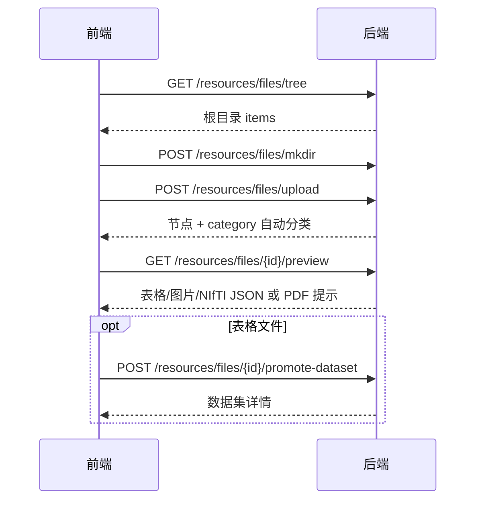
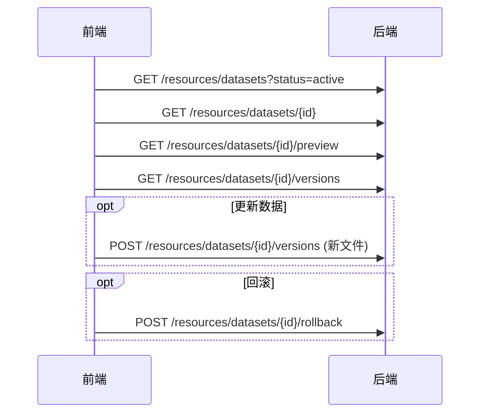
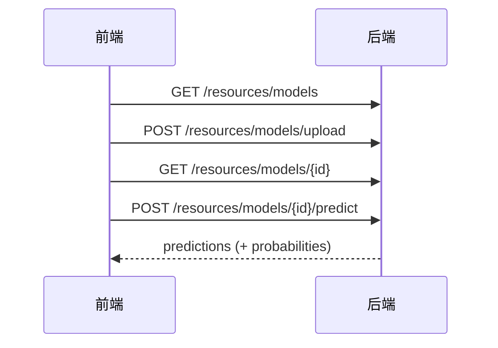

# 个人资源管理 — 前端对接指南

> **读者**：产品前端 / 联调前端开发  
> **后端**：AgentPlatform FastAPI，默认 `http://<host>:52716`  
> **联调页**：`http://<host>:52716/resources/ui`（原生 HTML，仅供对照行为）  
> **相关文档**：鉴权见 [`AUTH.md`](AUTH.md)；项目与会话见 [`2.1.1FrontendIntegrationGuide.md`](2.1.1FrontendIntegrationGuide.md)；**大文件上传**请优先使用分片协议 [`ChunkedUploadFrontend.md`](ChunkedUploadFrontend.md)（`resources_file` / `resources_dataset` / `resources_dataset_version` / `resources_model`）。整文件 `multipart` 上传接口已 deprecated。

本文档说明「个人资源管理」模块的业务含义、推荐页面流程，以及每个 API **做什么、何时调用、怎么调、返回什么**。  
该模块与项目 RBAC **独立**：只按登录用户 `user_id` 隔离，不需要 `project_id` / 会话权限码。

---

## 1. 模块能做什么

用户登录后，拥有一块「我的资源」空间，包含三个子模块：

| 子模块 | 用户能做什么 | 典型产品入口文案 |
|--------|--------------|------------------|
| **文件空间** | 建文件夹；上传/下载/预览/移动/删除文件；上传后自动识别类型（表格/图片/PDF/NIfTI 等） | 「我的文件」 |
| **数据集** | 把表格文件登记为数据集；看列名/类型/缺失值；预览行；多版本管理与回滚；归档 | 「我的数据集」 |
| **模型库** | 上传/下载 sklearn 模型（`.pkl`/`.joblib`）；查看元数据；在线预测；删除 | 「我的模型」 |

磁盘落点（前端无需关心路径，仅运维需知）：`{TEMP_FOLDER}/resources/<user_id>/…`。

---

## 2. 基本约定

| 项 | 说明 |
|----|------|
| Base URL | `http://<host>:52716` |
| 鉴权 | 除登录外，**全部**接口需要：`Authorization: Bearer <access_token>` |
| 成功响应 | `{"status":"success","data": ... }`，业务数据一律在 `data` 内 |
| 错误响应 | HTTP 4xx/5xx，`{"detail": "错误信息字符串"}`；鉴权失败见 AUTH.md |
| JSON 接口 | `Content-Type: application/json` |
| 文件上传 | `multipart/form-data`，**不要**手动设 `Content-Type`（让浏览器带 boundary） |
| 文件下载 | 返回二进制流（`FileResponse`），用 `blob` 触发浏览器下载 |
| 字符编码 | UTF-8 |

### 2.1 鉴权范围（本模块）

| 接口 | Token | 额外权限 |
|------|-------|----------|
| `/auth/send-sms-code`、`/auth/login-with-sms` | 不需要 | — |
| `/resources/files/*`、`/resources/datasets/*`、`/resources/models/*` | **需要** | 仅能操作当前用户自己的资源 |
| `GET /resources/ui`、`/static/resources/*` | 不需要 | 静态页；页内调 API 仍需 Token |

### 2.2 通用错误码（本模块常见）

| HTTP | 何时出现 | 前端建议 |
|------|----------|----------|
| 400 | 参数非法、非表格晋升数据集、模型特征列缺失等 | Toast 展示 `detail` |
| 401 | 未登录 / Token 过期 | 跳转登录 |
| 404 | 文件/数据集/模型不存在或无权（跨用户视为不存在） | 「资源不存在」 |
| 500 | 服务端异常 | 通用错误提示 + 重试 |

### 2.3 登录拿 Token（必做）

```http
POST /auth/login-with-sms
Content-Type: application/json

{ "phone": "13800000000", "code": "888888" }
```

成功后保存 `data.access_token`（或响应体中的 `access_token`，与平台登录接口一致）。  
验收环境需 `ACCEPTANCE_MODE=1`；正式环境走短信验证码流程，见 AUTH.md。

后续请求示例：

```http
GET /resources/files/tree
Authorization: Bearer <access_token>
```

---

## 3. 推荐页面与调用时序

### 3.1 产品信息架构建议

```text
登录
 └─ 我的资源（Tab 或三个子路由）
      ├─ 文件空间：左目录树 + 右文件列表 + 预览抽屉
      ├─ 数据集：列表 + 详情侧栏（schema / 预览 / 版本）
      └─ 模型库：列表 + 详情 + 预测面板
```

### 3.2 文件空间典型流程



**前端状态建议**：维护 `currentParentId`（`null` = 根目录）。进入子文件夹时设为该文件夹 `id`，再拉 `tree?parent_id=`。

### 3.3 数据集典型流程



### 3.4 模型库典型流程



临床模块训练出的风险模型会自动同步进模型库（`source=clinical_risk`），前端列表里可能直接看到，无需再上传。

---

## 4. 文件空间 API

> 前缀：`/resources/files`  
> 节点类型：`node_type = "folder" | "file"`  
> 智能分类：`category = table | image | document | imaging | text | binary | other`

### 4.1 列出目录内容 — `GET /resources/files/tree`

**作用**：拉取某一层文件夹下的子节点（文件夹 + 文件），用于渲染目录树或当前路径列表。

**何时调用**：进入文件空间；切换文件夹；上传/新建/移动/删除成功后刷新。

| 查询参数 | 类型 | 必填 | 说明 |
|----------|------|------|------|
| `parent_id` | int | 否 | 父文件夹 id；**省略或空 = 根目录** |

**成功 `data`**：

```json
{
  "parent_id": null,
  "items": [
    {
      "id": 3,
      "user_id": 1,
      "parent_id": null,
      "name": "影像",
      "node_type": "folder",
      "category": "other",
      "size_bytes": 0,
      "created_at": "2026-07-24T10:00:00"
    },
    {
      "id": 12,
      "name": "baseline.csv",
      "node_type": "file",
      "category": "table",
      "mime": "text/csv",
      "size_bytes": 10240,
      "tags": { "auto_classified": true, "suggest_dataset": true },
      "created_at": "2026-07-24T10:01:00"
    }
  ]
}
```

**前端注意**：

- `tags.suggest_dataset === true` 时可显示「登记为数据集」按钮。
- 只返回**未软删**节点；已删除不会出现。

---

### 4.2 新建文件夹 — `POST /resources/files/mkdir`

**作用**：在指定父目录下创建空文件夹。

**何时调用**：用户点击「新建文件夹」并输入名称后。

**请求体**：

```json
{ "parent_id": null, "name": "影像" }
```

| 字段 | 说明 |
|------|------|
| `parent_id` | 父文件夹 id，`null` = 根下创建 |
| `name` | 文件夹名；不可含 `/` `\`；同级不可重名 |

**成功**：`201`，`data` 为新建节点对象（含 `id`）。

**常见错误**：同级重名、父节点不是文件夹、父节点不存在。

---

### 4.3 上传文件 — `POST /resources/files/upload`

> **Deprecated（整文件）**：大文件请改用 [`ChunkedUploadFrontend.md`](ChunkedUploadFrontend.md)，`target=resources_file`。本接口仍可用，响应含 `deprecated: true`。

**作用**：把文件写入当前用户文件空间，并**自动识别类型**写入 `category`。

**何时调用**：用户选择文件并点击上传。

**请求**：`multipart/form-data`

| 字段 | 类型 | 必填 | 说明 |
|------|------|------|------|
| `file` | file | 是 | 原始文件 |
| `parent_id` | string/int | 否 | 上传到哪个文件夹；空 = 根目录 |

**成功**：`201`，`data` 为文件节点（含 `category`、`tags`、`size_bytes` 等）。

**前端注意**：

- 大小上限默认 **2048MB**（`RESOURCES_MAX_UPLOAD_MB`）。
- 同级（或磁盘 `files/` 目录）已存在同名时，自动重命名为 `原名 (1).ext`，不报错；节点 `name` 与磁盘 basename 一致。
- 白名单：常见表格/图片/PDF/文本/DICOM/NIfTI（`.nii` / `.nii.gz`）/ `.pkl` `.joblib` 等。

---

### 4.4 下载文件 — `GET /resources/files/{node_id}/download`

**作用**：下载某个**文件节点**的原始内容（文件夹不可下载）。

**何时调用**：用户点「下载」。

**响应**：二进制流；`Content-Disposition` 带文件名。

**前端示例**：`fetch` + `blob` + 临时 `<a download>`。请求头必须带 Bearer（不能直接用无鉴权的 `<a href>`，除非网关另有方案）。

---

### 4.5 在线预览 — `GET /resources/files/{node_id}/preview`

**作用**：按文件类型返回适合前端渲染的预览数据，避免先整文件下载再解析。

**何时调用**：用户选中文件、打开预览抽屉/弹窗。

| 查询参数 | 说明 |
|----------|------|
| `as_file` | 默认 `false` 返回 JSON；`true` 时强制返回文件流（PDF iframe/blob 场景用） |

**默认 JSON 的 `data.kind` 分支**：

| kind | 前端怎么渲染 | 主要字段 |
|------|--------------|----------|
| `table` | 表格组件 | `columns`、`dtypes`、`preview_rows`（≤50 行）、`truncated` |
| `image` | `` | `mime`、`data_base64` |
| `nifti` | 同图片 + 展示 shape | `mime`、`data_base64`、`shape`、`slice_index` |
| `pdf` | 再请求 `?as_file=true` 取 blob，用 iframe/`pdf.js` | `kind`、`size_bytes` |
| `text` | `<pre>` | `content`、`truncated` |
| `binary` | 提示「请下载」 | `message` |

**PDF 推荐写法**：

1. `GET .../preview` → 确认 `kind === "pdf"`  
2. `GET .../preview?as_file=true`（带 Token）→ `blob` → `URL.createObjectURL` → iframe

**依赖提示**：NIfTI 需要服务端安装 `nibabel`；未安装时 `detail` 会说明依赖缺失。

---

### 4.6 移动节点 — `POST /resources/files/{node_id}/move`

**作用**：把文件或文件夹移动到另一父目录（或根目录）。

**何时调用**：用户选择「移动」并选定目标文件夹。

**请求体**：

```json
{ "target_parent_id": 3 }
```

`target_parent_id: null` 表示移到根目录。

**约束**：不能移入自身或其子孙目录；目标目录下若已有同名节点，会自动将当前节点重命名为 `原名 (1).ext`（文件节点同步重命名磁盘文件，保持 `name` 与 basename 一致）。

---

### 4.7 删除节点 — `DELETE /resources/files/{node_id}`

**作用**：软删除文件；若是文件夹则**递归软删**所有子孙。

**何时调用**：用户确认删除后。

**成功 `data` 示例**：

```json
{
  "id": 12,
  "deleted": true,
  "referenced_datasets": 1,
  "warning": "该文件仍被 1 个活跃数据集引用"
}
```

**前端注意**：有 `warning` 时建议二次提示；数据集版本文件仍保留，只是来源文件节点被标记删除。

---

### 4.8 晋升为数据集 — `POST /resources/files/{node_id}/promote-dataset`

**作用**：把已上传的**表格文件**登记成数据集（复制一份到数据集版本目录并解析元数据）。

**何时调用**：文件列表里对 `category=table` 点「登记为数据集」。

**请求体**：

```json
{ "name": "基线量表", "description": "2026 基线" }
```

| 字段 | 说明 |
|------|------|
| `name` | 可选；默认用去掉扩展名的文件名 |
| `description` | 可选 |

**成功**：`201`，`data` 结构与「获取数据集详情」相同（含 `dataset` + `current_version_meta`）。

**失败常见原因**：不是文件节点、不是 `table` 类别、解析 CSV/Excel 失败。

---

## 5. 数据集 API

> 前缀：`/resources/datasets`  
> 状态：`active`（正常） / `archived`（归档，列表可筛）  
> 版本：每次上传新文件或刷新元数据都会 `current_version + 1`

### 5.1 数据集列表 — `GET /resources/datasets`

**作用**：分页拉取当前用户的数据集，用于列表页。

**何时调用**：进入数据集 Tab；搜索/筛选变更；创建/归档后刷新。

| 查询参数 | 类型 | 默认 | 说明 |
|----------|------|------|------|
| `status` | string | — | `active` / `archived`；省略=全部 |
| `keyword` | string | — | 匹配名称或描述 |
| `limit` | int | 50 | 1–200 |
| `offset` | int | 0 | 偏移 |

**成功 `data`**：

```json
{
  "items": [
    {
      "id": 1,
      "name": "基线量表",
      "description": "",
      "category": "table",
      "source_file_id": 12,
      "current_version": 2,
      "status": "active",
      "updated_at": "2026-07-24T12:00:00"
    }
  ],
  "total": 1,
  "limit": 50,
  "offset": 0
}
```

---

### 5.2 从已有文件创建 — `POST /resources/datasets`

**作用**：指定文件空间里的某个表格节点，创建数据集（与 promote 同类能力，适合「已选好 file id」的表单）。

**何时调用**：创建向导里用户选择了 `source_file_id`。

**请求体**：

```json
{
  "name": "基线",
  "description": "",
  "source_file_id": 12
}
```

**成功**：`201`，详情结构见 §5.4。

---

### 5.3 直接上传创建 — `POST /resources/datasets/upload`

**作用**：一步完成「上传到文件空间 + 创建数据集」，适合数据集页的快捷入口。

**何时调用**：数据集页「上传为数据集」。

**请求**：`multipart/form-data`

| 字段 | 必填 | 说明 |
|------|------|------|
| `file` | 是 | csv/tsv/xlsx/xls/parquet |
| `name` | 否 | 数据集名 |
| `description` | 否 | 描述 |

内部会先在文件空间根目录落一份文件，再创建 v1。

---

### 5.4 数据集详情 — `GET /resources/datasets/{dataset_id}`

**作用**：获取数据集主记录 + **当前版本**的完整元数据（含 schema、缺失统计、预览抽样）。

**何时调用**：用户点击某条数据集进入详情。

**成功 `data`**：

```json
{
  "dataset": {
    "id": 1,
    "name": "基线量表",
    "description": "",
    "current_version": 2,
    "status": "active",
    "source_file_id": 12
  },
  "current_version_meta": {
    "version": 2,
    "row_count": 100,
    "column_count": 8,
    "schema_json": [
      {
        "name": "age",
        "dtype": "int64",
        "non_null": 100,
        "null_count": 0,
        "null_rate": 0.0
      }
    ],
    "missing_stats_json": {
      "age": { "null_count": 0, "null_rate": 0.0 }
    },
    "preview_json": {
      "columns": ["age", "score"],
      "rows": [{ "age": 30, "score": 12 }]
    },
    "note": "版本 2",
    "created_at": "2026-07-24T12:00:00"
  }
}
```

**字段释义（给产品文案）**：

| 字段 | 含义 |
|------|------|
| `schema_json` | 每列：列名、pandas dtype、非空数、缺失数、缺失率 |
| `missing_stats_json` | 按列汇总的缺失统计（可做缺失条形图） |
| `preview_json` | 抽样预览行（默认最多约 50 行） |
| `row_count` / `column_count` | 全表规模 |

---

### 5.5 数据预览 — `GET /resources/datasets/{dataset_id}/preview`

**作用**：只取「展示预览表」所需字段，比详情更轻（适合详情页已打开、只需刷新预览表时）。

**何时调用**：详情页「数据预览」区域；切换当前版本后刷新。

**成功 `data` 要点**：`preview`、`schema`、`missing_stats`、`row_count`、`column_count`、`version`。

---

### 5.6 下载当前版本 — `GET /resources/datasets/{dataset_id}/download`

**作用**：下载数据集**当前版本**对应的表格文件（不是文件空间原始节点）。

**何时调用**：详情页「下载」。

**响应**：文件流。

---

### 5.7 上传新版本 — `POST /resources/datasets/{dataset_id}/versions`

**作用**：用新文件生成下一版本，自动重算 schema / 缺失 / 预览，并更新 `current_version`。

**何时调用**：用户「上传新版本」；运维更新数据。

**请求**：`multipart/form-data`

| 字段 | 必填 | 说明 |
|------|------|------|
| `file` | 是 | 新版本表格文件 |
| `note` | 否 | 版本备注，如「修正缺失值」 |

**约束**：已归档（`archived`）的数据集不可上传新版本，需先 `PATCH` 恢复为 `active`。

**成功**：`201`，返回最新详情。

---

### 5.8 版本列表 — `GET /resources/datasets/{dataset_id}/versions`

**作用**：列出历史版本（**不含**完整 `preview_json`，减轻载荷），用于版本时间线。

**何时调用**：打开详情后加载版本区。

**成功 `data`**：

```json
{
  "dataset_id": 1,
  "current_version": 2,
  "versions": [
    {
      "version": 2,
      "row_count": 100,
      "column_count": 8,
      "note": "版本 2",
      "created_at": "..."
    },
    { "version": 1, "note": "初始版本", "row_count": 98, "column_count": 8 }
  ]
}
```

---

### 5.9 回滚版本 — `POST /resources/datasets/{dataset_id}/rollback`

**作用**：把 `current_version` 指针切到历史某一版（**不删**其它版本文件）。

**何时调用**：用户在版本列表点「回滚到此版本」并确认。

**请求体**：

```json
{ "version": 1 }
```

**成功**：返回回滚后的详情（预览等变为该版本内容）。

---

### 5.10 更新元信息 — `PATCH /resources/datasets/{dataset_id}`

**作用**：改名、改描述、归档/恢复（改 `status`）。

**何时调用**：编辑表单保存；「归档」「恢复」按钮。

**请求体**（字段均可选，只传要改的）：

```json
{ "name": "新名称", "description": "...", "status": "archived" }
```

`status` 仅允许 `active` | `archived`。

---

### 5.11 归档（删除入口）— `DELETE /resources/datasets/{dataset_id}`

**作用**：将数据集标记为 `archived`（软归档，版本文件仍保留，便于恢复）。

**何时调用**：用户点「归档/删除」；与 `PATCH status=archived` 等价能力。

**恢复方式**：再调 `PATCH`，`"status": "active"`。

---

### 5.12 刷新元数据 — `POST /resources/datasets/{dataset_id}/refresh-meta`

**作用**：不换数据文件语义下，基于当前版本文件重新解析统计，并生成带备注「刷新元数据」的新版本。

**何时调用**：运维怀疑 schema 过期；用户点「刷新元数据」。

---

## 6. 模型库 API

> 前缀：`/resources/models`  
> 当前仅支持 **sklearn / joblib / pickle** 模型在线预测  
> `source`：`manual`（用户上传）或 `clinical_risk`（临床风险训练自动同步）

### 6.1 模型列表 — `GET /resources/models`

**作用**：列出当前用户可用模型（`status=active`）。

**何时调用**：进入模型库；上传/删除后刷新。

| 查询参数 | 说明 |
|----------|------|
| `keyword` | 匹配名称 / model_type / task_type |
| `limit` / `offset` | 分页，同数据集 |

**成功 `data`**：`{ items, total, limit, offset }`。  
`items` 中常见字段：`id`、`model_name`、`framework`、`model_type`、`task_type`、`features`、`metrics`、`source`、`created_at`。

---

### 6.2 上传模型 — `POST /resources/models/upload`

**作用**：上传 `.pkl` / `.joblib`，登记到模型库；服务端会尝试加载校验，损坏文件会拒绝。

**何时调用**：用户「上传模型」表单提交。

**请求**：`multipart/form-data`

| 字段 | 必填 | 说明 |
|------|------|------|
| `file` | 是 | `.pkl` 或 `.joblib` |
| `model_name` | 是 | 展示名称 |
| `model_type` | 否 | 如 `logistic_regression` |
| `task_type` | 否 | 如 `binary_classification` |
| `features` | 否 | **字符串形式的 JSON 数组**，如 `'["age","score"]'` |
| `metrics` | 否 | JSON 对象字符串 |
| `params` | 否 | JSON 对象字符串 |

**强烈建议**上传时带上 `features`：预测时会校验入参列是否齐全，避免静默错列。

**成功**：`201`，`data` 为模型元数据对象。

---

### 6.3 模型详情 — `GET /resources/models/{model_id}`

**作用**：获取单个模型的完整元数据（特征、指标、来源等），用于详情面板。

**何时调用**：列表中点击某一模型。

---

### 6.4 下载模型 — `GET /resources/models/{model_id}/download`

**作用**：下载模型二进制文件，便于本地复用或备份。

**何时调用**：「下载」按钮。响应为文件流。

---

### 6.5 删除模型 — `DELETE /resources/models/{model_id}`

**作用**：标记删除并从磁盘尝试移除模型文件。

**何时调用**：用户确认删除后。列表中不再出现。

---

### 6.6 在线预测 — `POST /resources/models/{model_id}/predict`

**作用**：用已登记模型对一批样本做 `predict`（若有则附带 `predict_proba`）。

**何时调用**：详情页填写特征 JSON 后点「运行预测」。

**请求体**：

```json
{
  "rows": [
    { "age": 30, "score": 12 },
    { "age": 45, "score": 8 }
  ]
}
```

| 约束 | 说明 |
|------|------|
| `rows` | 至少 1 行；单次默认最多 **5000** 行（`RESOURCES_PREDICT_MAX_ROWS`） |
| 特征列 | 若模型登记了 `features`，每行必须包含全部特征名 |

**成功 `data` 示例**：

```json
{
  "model_id": 5,
  "model_name": "risk_logit_20260724",
  "n_rows": 2,
  "features_used": ["age", "score"],
  "predictions": [0, 1],
  "probabilities": [[0.8, 0.2], [0.3, 0.7]]
}
```

**前端展示建议**：表格展示 `predictions`；若有 `probabilities`，按类别概率列展示。  
分类模型无 `predict_proba` 时 `probabilities` 可能为 `null`。

---

## 7. 前端实现要点（易踩坑）

1. **所有资源 API 都要带 Bearer**；静态页 `/resources/ui` 本身不鉴权。  
2. **下载 / PDF 流**不能指望无 Token 的普通链接，请用 `fetch`+`blob`。  
3. **上传**用 `FormData`，不要手写 `Content-Type`。  
4. **根目录**统一用 `parent_id = null` / 不传，不要传 `0`。  
5. **文件节点 id** 与 **数据集 id**、**模型 id** 是三套主键，不要混用。  
6. 预览表格与数据集预览的行数有上限，全量请走下载。  
7. 模型 `features` 在 multipart 里必须是 **JSON 字符串**，不是重复 form 字段。  
8. 本模块**不依赖** `project_id` / `session_id`；与分析会话打通可后续另做「导入到会话」。

### 7.1 最小请求封装示例

```js
const API = ""; // 同源；若反代前缀则如 "/agent-api"
let token = localStorage.getItem("agent_access_token") || "";

async function api(method, path, body) {
  const headers = {};
  if (token) headers.Authorization = "Bearer " + token;
  if (body != null) headers["Content-Type"] = "application/json";
  const res = await fetch(API + path, {
    method,
    headers,
    body: body != null ? JSON.stringify(body) : undefined,
  });
  const data = await res.json().catch(() => ({}));
  if (!res.ok) throw new Error(data.detail || res.statusText);
  return data.data != null ? data.data : data;
}
```

联调参考实现：[`src/frontend/web/resources/app.js`](../src/frontend/web/resources/app.js)。

---

## 8. 环境与联调

| 项 | 说明 |
|----|------|
| 启动后端 | `bash scripts/start.sh`（见 [`StartInstruction.md`](StartInstruction.md)） |
| 联调 UI | `http://<host>:52716/resources/ui` |
| 静态资源 | `/static/resources/styles.css`、`/static/resources/app.js` |
| 验收登录 | `ACCEPTANCE_MODE=1`，手机号 `13800000000`，验证码 `888888` |
| 磁盘目录 | 默认 `tmp/resources/<user_id>/`，可用 `RESOURCES_ROOT` 覆盖 |
| NIfTI 预览 | 主环境需 `pip install 'nibabel>=5.3.0'` |

### 8.1 MySQL 是否已就绪？

**配置侧已对齐**（与现有平台共用同一库，无需新建 database）：

| 项 | 值（见 `.env` / `configs/config.py`） |
|----|------|
| Host / Port | `localhost:3308` |
| Database | `agent_platform` |
| 本模块新表 | `user_files`、`user_datasets`、`user_dataset_versions`、`user_models` |

**建表方式（二选一）**：

1. **自动**：后端连上 MySQL 后，任意资源 API 首次执行时会 `CREATE TABLE IF NOT EXISTS`（`ensure_resource_tables`）。  
2. **手工（推荐上线前执行）**：

```bash
mysql -h127.0.0.1 -P3308 -uroot -p agent_platform < scripts/sql/resource_tables.sql
```

验表：

```sql
SHOW TABLES LIKE 'user_%';
-- 应看到 user_files / user_datasets / user_dataset_versions / user_models
```

> **注意**：若本机 `3308` 未监听（`Connection refused`），说明 **mysqld 当前未启动**，不是「表没建好」。请先启动 MySQL 服务，再执行上述 SQL 或重启后端触发自动建表。历史临床模型迁入模型库：`PYTHONPATH=src python scripts/migrate_risk_models_to_registry.py`。

---

## 9. API 速查表

| 方法 | 路径 | 一句话用途 |
|------|------|------------|
| GET | `/resources/files/tree` | 列目录 |
| POST | `/resources/files/mkdir` | 新建文件夹 |
| POST | `/resources/files/upload` | 上传并自动分类 |
| GET | `/resources/files/{id}/download` | 下载文件 |
| GET | `/resources/files/{id}/preview` | 在线预览 |
| POST | `/resources/files/{id}/move` | 移动 |
| DELETE | `/resources/files/{id}` | 软删除 |
| POST | `/resources/files/{id}/promote-dataset` | 表格→数据集 |
| GET | `/resources/datasets` | 数据集列表 |
| POST | `/resources/datasets` | 从文件创建数据集 |
| POST | `/resources/datasets/upload` | 上传即创建数据集 |
| GET | `/resources/datasets/{id}` | 详情+当前版本元数据 |
| GET | `/resources/datasets/{id}/preview` | 预览表 |
| GET | `/resources/datasets/{id}/download` | 下载当前版本 |
| POST | `/resources/datasets/{id}/versions` | 上传新版本 |
| GET | `/resources/datasets/{id}/versions` | 版本列表 |
| POST | `/resources/datasets/{id}/rollback` | 回滚版本 |
| PATCH | `/resources/datasets/{id}` | 改名/归档/恢复 |
| DELETE | `/resources/datasets/{id}` | 归档 |
| POST | `/resources/datasets/{id}/refresh-meta` | 刷新元数据 |
| GET | `/resources/models` | 模型列表 |
| POST | `/resources/models/upload` | 上传模型 |
| GET | `/resources/models/{id}` | 模型详情 |
| GET | `/resources/models/{id}/download` | 下载模型 |
| DELETE | `/resources/models/{id}` | 删除模型 |
| POST | `/resources/models/{id}/predict` | 在线预测 |
