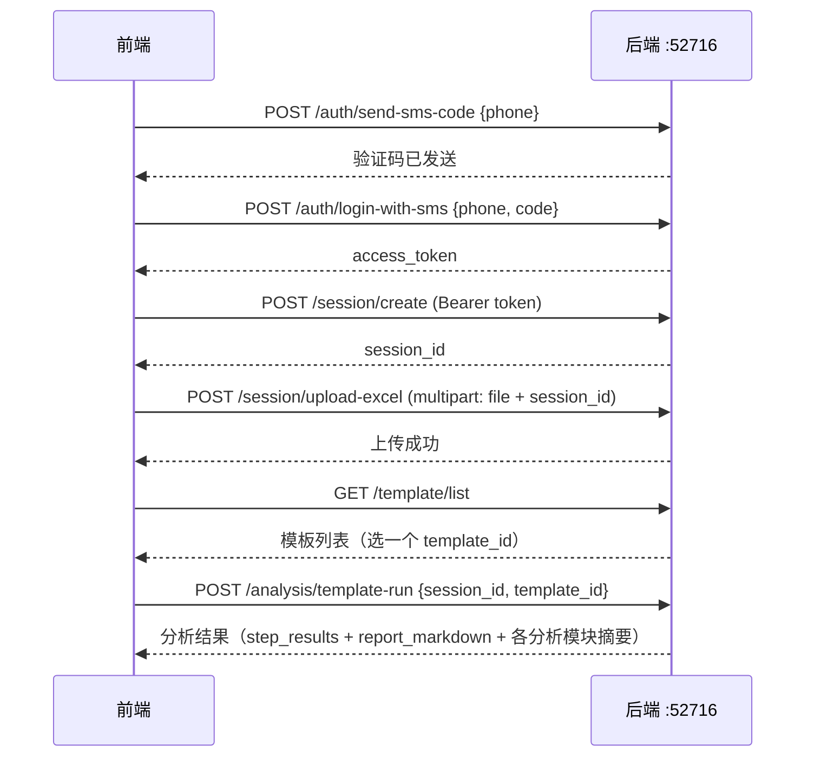

# 模板分析 API — 接口文档（给前端对接用）

> 模板分析已整合进 AgentPlatform 主框架。联调 UI 见 `src/frontend/app.py` 的「模板分析」页（`bash scripts/start.sh --with-frontend`）。**正式产品前端请直接按本文档对接 HTTP 接口。**
>
> 本文档覆盖 **模板管理 + 模板驱动分析** 接口。
>
> **项目管理、RBAC、会话与鉴权** 见 [`FrontendIntegrationGuide.md`](FrontendIntegrationGuide.md)（产品前端主入口）；接口字段细节见 [`BackendAPI.md`](BackendAPI.md) 与 [`AUTH.md`](AUTH.md)。

---

## 1. 基本信息

| 项 | 值 |
|---|---|
| 服务 | FastAPI，与原平台共用同一进程 |
| Base URL | `http://<host>:52716` |
| 数据格式 | 请求/响应均为 `application/json`（文件上传除外，见 §3.2） |
| 鉴权方式 | JWT Bearer Token，登录后放在请求头 `Authorization: Bearer <access_token>` |
| 字符编码 | UTF-8 |

### 1.1 鉴权范围

| 接口分组 | 是否需要 Bearer Token | 附加要求 |
|---|---|---|
| `/auth/*` 登录相关 | 不需要（`/auth/me` 除外） | — |
| `/session/*` | 需要 | 项目 RBAC（上传/分析等按权限码） |
| `GET /template/list`、`GET /template/{id}` | **需要** | 任意已登录用户 |
| `POST/PUT/DELETE /template/*`、`POST /template/import` | **需要** | **平台管理员**（`platform_role=admin`） |
| `POST /analysis/template-run` | **需要** | 会话归属 + `analysis_create` 权限 |

### 1.2 通用错误格式

大多数错误是 `HTTPException`，形如：

```json
{ "detail": "错误信息字符串" }
```

鉴权失败（401 / 403）例外，`detail` 是对象：

```json
{ "detail": { "code": 6, "msg": "unauthorized" } }
```

| HTTP | 场景 |
|---|---|
| 400 | 参数缺失/校验失败（如 `session_id` 为空、`disease_type` 不合法） |
| 401 | 未带 token / token 失效 |
| 403 | token 有效但 `session_id` 不属于当前用户 |
| 404 | 资源不存在（模板不存在 / session_id 不存在） |
| 413 / 415 | 上传文件过大 / 类型不支持 |
| 500 | 服务端异常（数据库、算子执行内部错误） |

---

## 2. 典型对接流程



验收/联调可以跳过“创建会话+上传文件”，直接复用内置的演示账号与会话（见 §6.2），正式对接建议走完整流程。

---

## 3. 前置接口（原平台已有，这里给最小可用说明）

### 3.1 登录

```
POST /auth/send-sms-code
Content-Type: application/json

{ "phone": "13800000000" }
```

```
POST /auth/login-with-sms
Content-Type: application/json

{ "phone": "13800000000", "code": "888888" }
```

响应：

```json
{
  "code": 0,
  "msg": "login success",
  "data": {
    "access_token": "eyJhbGciOi...",
    "token_type": "bearer",
    "expires_in": 604800,
    "user_id": 2,
    "username": "user_0000_xxx",
    "phone": "13800000000"
  }
}
```

> 手机号 `13800000000` + 验证码 `888888` 是**验收专用固定账号**，只在后端环境变量 `ACCEPTANCE_MODE=1` 时生效；生产环境请关闭该开关，走真实短信验证码。

之后所有请求带上：

```
Authorization: Bearer <access_token>
```

### 3.2 创建会话 / 上传数据文件

```
POST /session/create
Authorization: Bearer <token>
```

```json
{ "status": "success", "msg": "session created", "data": { "session_id": "xxxxxxxx-xxxx-...", "user_id": 2, "workspace_abs_path": "/.../workspace/sessions/xxxx" } }
```

```
POST /session/upload-excel
Authorization: Bearer <token>
Content-Type: multipart/form-data

file: <二进制文件，.xlsx/.xls/.csv>
session_id: <上一步拿到的 session_id>
```

```json
{
  "status": "success",
  "message": "文件已写入会话工作区根目录",
  "session_id": "xxxx",
  "relative_path": "data.xlsx",
  "original_filename": "我的数据.xlsx",
  "file_category": "table",
  "workspace_abs_path": "/.../workspace/sessions/xxxx"
}
```

> `POST /analysis/template-run` 会自动在该会话工作区目录里找第一个 `.xlsx/.xls/.csv/.tsv` 文件来分析，**不需要**额外传文件路径（除非你想强制指定，见 §4.3 的 `file_path` 参数）。

---

## 4. 2.1.5 核心接口

### 4.1 模板列表

```
GET /template/list?disease_type=depression   # disease_type 可选，不传则返回全部
```

响应：

```json
{
  "status": "success",
  "data": [
    {
      "id": 8,
      "template_name": "抑郁障碍分析模板",
      "disease_type": "depression",
      "scales": [ { "name": "HAMD-17", "full_name": "...", "items": 17, "range": "0-52", "reference": "...", "severity": {"mild":8,"moderate":14,"severe":23} } ],
      "analysis_steps": [ { "step": 1, "name": "数据质控", "operator": "missing_summary", "description": "缺失率/数据类型/唯一值统计" }, "... 共 N 步 ..." ],
      "report_structure": ["研究对象基本信息", "数据质控结果", "..."],
      "version": "2.0.0",
      "version_history": null,
      "created_at": "2026-07-01T12:05:00",
      "updated_at": "2026-07-01T12:05:00"
    }
  ]
}
```

`disease_type` 取值范围：`depression` / `schizophrenia` / `anxiety` / `sleep` / `child_adolescent`。

### 4.2 模板详情 / 创建 / 更新 / 删除 / 批量导入

| 接口 | 说明 |
|---|---|
| `GET /template/{id}` | 单个模板详情，字段同上；不存在返回 404 `"模板不存在"` |
| `POST /template/create` | 创建模板，body 见下 |
| `PUT /template/{id}` | 更新模板（所有字段可选，只传要改的字段）；每次更新会把旧版本存进 `version_history` 并把 `version` 的 PATCH 位 +1 |
| `DELETE /template/{id}` | 删除模板 |
| `POST /template/import` | 无 body；扫描服务器 `knowledge/templates/*.json` 批量导入（用于初始化/重置模板库） |

`POST /template/create` / `PUT /template/{id}` 请求体：

```json
{
  "template_name": "自定义模板名",
  "disease_type": "depression",
  "scales": ["HAMD-17", "PHQ-9"],
  "analysis_steps": [
    { "step": 1, "name": "数据质控", "action": "missing_summary", "params": {} },
    { "step": 2, "name": "描述统计", "action": "describe_full" }
  ],
  "report_structure": ["数据质控结果", "描述统计", "结论"],
  "version": "1.0.0"
}
```

字段校验规则（不满足会返回 400）：

- `template_name` 必填，1~256 字符
- `disease_type` 必须是上面 5 个枚举值之一
- `scales`、`analysis_steps`、`report_structure` 均至少 1 项
- `version` 需符合 `MAJOR.MINOR.PATCH`（如 `1.0.0`）
- `template_name` 全局唯一，重复会报错 `"模板名称已存在: xxx"`

> 注意：`analysis_steps` 里请求模型字段名是 `action`（`TemplateCreateRequest`），但**实际执行时读取的是 `operator`**（`template_step_executor.py` 里 `step_def.get("operator") or step_def.get("action")`）。已发布的 5 个内置模板 JSON（`knowledge/templates/*.json`）用的字段名是 `operator`。**新建/编辑模板时建议直接写 `operator`**，避免歧义；`action` 仅作为兼容兜底。可执行的 `operator` 取值见 §5。

`POST /template/import` 响应：

```json
{
  "status": "success",
  "data": {
    "imported": 5,
    "skipped": 0,
    "details": ["anxiety.json: 已导入 (id=6)", "..."]
  }
}
```

### 4.3 发起模板分析（核心接口）

```
POST /analysis/template-run
Authorization: Bearer <token>
Content-Type: application/json

{
  "session_id": "xxxx-xxxx",
  "template_id": 8,
  "file_path": null   // 可选：强制指定要分析的文件绝对/相对路径；不传则自动找该会话工作区里的第一个 xlsx/csv
}
```

**这是同步接口**（不是流式/SSE），后端会顺序跑完模板里定义的全部 `analysis_steps` 才返回，数据量大或步骤多时请把前端请求超时设置到 60s 以上。

成功响应（200）：

```json
{
  "status": "success",
  "data": {
    "template_id": 8,
    "template_name": "抑郁障碍分析模板",
    "disease_type": "depression",
    "data_file": "mental_health_sample.xlsx",
    "row_count": 210,
    "column_count": 17,
    "execution_mode": "template_steps_medical_operators",

    "step_results": [
      {
        "step": 1,
        "name": "数据质控",
        "operator": "missing_summary",
        "method": "缺失率/类型质控",
        "description": "缺失率/数据类型/唯一值统计",
        "status": "ok",
        "outputs": { "summary_csv": { "rows": 17, "columns": ["column","dtype","n_missing","missing_rate","n_unique"], "records": [ {"column":"age","dtype":"int64","n_missing":0,"missing_rate":0.0,"n_unique":55} ] }, "total_missing_cells": 0, "n_rows": 210 }
      },
      {
        "step": 6,
        "name": "HAMD因子分计算",
        "operator": "factor_score",
        "status": "skipped",
        "note": "无条目级量表列，仅有总分；跳过因子分（需 HAMD/PANSS 条目）"
      },
      {
        "step": 11,
        "name": "症状网络分析",
        "operator": "symptom_network_analysis",
        "status": "error",
        "error": "错误信息字符串（如缺依赖/数据不足）"
      }
    ],

    "analysis_steps_executed": ["数据质控", "异常值检测", "..."],
    "analysis_steps_skipped": ["HAMD因子分计算"],
    "analysis_steps_errors": [],

    "report_markdown": "## 抑郁障碍分析模板 (depression)\n\n- 数据文件: `mental_health_sample.xlsx` (210 行)\n...",

    "data_distribution": ["..."],
    "scale_correlation": {"...": "..."},
    "medication_outcome_assoc": {"...": "..."},
    "relapse_analysis": {"...": "..."},
    "symptom_network": {"...": "..."},
    "ordinal_regression": {"...": "..."},
    "cox_regression": {"...": "..."}
  }
}
```

#### 4.3.1 `step_results[]` 字段说明

| 字段 | 说明 |
|---|---|
| `step` | 步骤序号（对应模板 `analysis_steps[].step`） |
| `name` | 步骤中文名 |
| `operator` | 实际调用的 `operator_library` 算子 key |
| `method` | 算子对应的统计方法中文说明（写死的映射表，见 `template_step_executor._method_label`） |
| `description` | 模板里给这一步写的说明文字 |
| `status` | `ok` \| `skipped` \| `error`（`pending` 只是执行中间态，不会出现在最终响应里） |
| `note` | `status=skipped` 或部分 `ok`（如责任者分析自动降级横截面）时的补充说明 |
| `error` | `status=error` 时的异常信息 |
| `outputs` | `status=ok` 时才有，结构因算子而异，见 §4.3.2 |

**什么时候会 `skipped`（不是 bug，是数据不满足前提条件）：**

- `factor_score`：数据里只有量表总分（如 `HAMD_total`），没有逐条目列（如 `HAMD_1`...`HAMD_17`），无法算因子分
- `ordinal_regression`：有效样本 < 30，或结局分类 < 3 类
- 未注册的 `operator`（模板里配了算子库里没有的算子名）

**什么时候会 `error`：** 通常是环境缺依赖包，或该步骤所需字段在数据里完全缺失且没有兜底逻辑；`error` 字段会带具体异常文本，方便定位。

#### 4.3.2 `outputs` 结构（按算子）

`outputs` 里每一项如果来自 DataFrame，会被序列化成统一形状：

```json
{ "rows": 17, "columns": ["col1","col2"], "records": [ {"col1": 1, "col2": "x"}, "...最多 80 行..." ] }
```

各算子 `outputs` 顶层 key（可用于前端按需渲染对应图表/表格）：

| operator | outputs 顶层字段 |
|---|---|
| `missing_summary` | `summary_csv`（表格）, `total_missing_cells`, `n_rows` |
| `outlier_iqr_flag` | `flags_csv`（表格）, `bounds`, `n_outlier_rows`, `n_sentinel_rows` |
| `data_imputation` | `imputed_csv`（表格）, `method`, `fill_values`, `n_filled_cells`, `n_rows_in/out/dropped` |
| `describe_full` | `stats_csv`（表格，count/mean/std/IQR/skew/kurtosis 等）, `n_columns` |
| `distribution_histogram` | `hist_csv`（表格）, `n_columns`, `n_bins` |
| `factor_score` | 视条目情况而定（多为 `skipped`，见上） |
| `responder_analysis` | `summary`（对象：chi2/dof/p_value 或纵向 responder 定义）, `table_csv` |
| `ordinal_regression` | `coef_table_csv`, `thresholds_csv`, `predictions_csv`, `n_obs`, `n_levels`, `log_likelihood`, `mcfadden_pseudo_r2`, `aic`, `bic`, `brant_test` |
| `survival_kaplan_meier` | `curve_csv`, `summary_csv`, `n_obs`, `n_groups`, `logrank_p`, `groups` |
| `cox_regression` | `coefficients_csv`, `metrics`（c-index 等）, `summary` |
| `symptom_network_analysis` | `edge_list_csv`, `centrality_csv`, `partial_corr_matrix_csv`, `n_edges`, `density`, `top_3_by_strength`, `top_3_by_expected_influence` |
| `correlation` | `matrix_csv`（相关矩阵）, `pairs_csv` / `pairs_df`（两两相关+p值列表） |

> 以上字段是当前实现的实际输出，仅供前端渲染参考；不建议前端写死校验“必须包含哪些字段”，请做好容错（字段缺失时不渲染对应模块即可），因为不同模板/不同数据列可能导致同一算子输出细节略有差异。

#### 4.3.3 失败响应示例

```json
{ "detail": "session_id 不存在，请先创建会话" }        // 404
{ "detail": "session_id 与 template_id 必填" }          // 400
{ "detail": "模板不存在" }                              // 400
{ "detail": "未找到可分析的数据文件，请先上传 xlsx/csv" } // 400
{ "detail": "读取数据失败: ..." }                        // 400
{ "detail": { "code": 7, "msg": "forbidden: session access denied" } } // 403，session 不是当前用户的
```

---

## 5. 内置 5 个模板 & 可用算子（operator）一览

| disease_type | 模板名 | 典型 operator 序列 |
|---|---|---|
| `depression` | 抑郁障碍分析模板 | missing_summary → outlier_iqr_flag → data_imputation → describe_full → distribution_histogram → factor_score → responder_analysis → ordinal_regression → survival_kaplan_meier → cox_regression → symptom_network_analysis → correlation |
| `schizophrenia` | 精神分裂症分析模板 | 同上思路，围绕 PANSS |
| `anxiety` | 焦虑障碍分析模板 | 同上思路，围绕 HAMA/GAD-7 |
| `sleep` | 睡眠障碍分析模板 | 同上思路，围绕睡眠量表 |
| `child_adolescent` | 儿童青少年精神障碍分析模板 | 同上思路 |

当前 `operator_library` 已注册、可在 `analysis_steps[].operator` 里使用的算子 key（`template_step_executor._get_solver`）：

```
missing_summary, outlier_iqr_flag, data_imputation,
describe_full, distribution_histogram,
correlation, ordinal_regression,
survival_kaplan_meier, cox_regression,
symptom_network_analysis, factor_score,
responder_analysis   （特殊处理：纵向数据自动用 responder 定义，横截面数据自动降级为卡方检验）
```

> `operator_library/solvers/` 下还有更多统计算子（如 `logistic_regression`、`propensity_score_matching`、`tree_models`、`time_series_*` 等），但**目前只有上面这份列表接入了模板执行器**；如果新模板想用其它算子，需要先在 `template_step_executor.py` 的 `_get_solver` / `_build_mapping` 里补映射，否则该步骤会 `status=skipped`，`note="算子 xxx 未注册"`。

---

## 6. 前端接入注意事项

### 6.1 已知限制

- `/template/*`（CRUD + import）目前**没有做鉴权校验**，任何能访问到 52716 端口的客户端都能改模板库。如果前端要暴露"模板管理"给普通用户自助编辑，建议先跟后端确认是否需要加 `Authorization` 校验和角色权限（当前只有 `/analysis/template-run` 校验了登录与会话归属）。
- `POST /analysis/template-run` 是同步阻塞调用，模板步骤多、数据量大时响应可能需要几秒到十几秒，**不是流式返回**，前端要有 loading 态，不要用原平台 `/run-analysis` 的 SSE 处理方式套用在这个接口上。
- 模板里 `analysis_steps` 请优先用 `operator` 字段名（不要只写 `action`），见 §4.2 的注意事项。

### 6.2 验收/联调专用固定数据（不要用在生产逻辑里）

| 项 | 值 |
|---|---|
| 验收手机号 | `13800000000` |
| 验收验证码 | `888888`（仅 `ACCEPTANCE_MODE=1` 时有效） |
| 预置演示会话 | `acceptance-demo-session`（已绑定 210 行样例数据 `mental_health_sample.xlsx`） |

可以用这套账号 + 会话快速跑通「登录 → 拉模板 → 发起分析」联调，不需要自己造数据；正式对接时改成真实登录 + `/session/create` + `/session/upload-excel` 即可，接口协议完全一致。

---

## 7. 最小可运行示例（JavaScript / fetch）

```js
const BASE = "http://<host>:52716";

async function loginAndAnalyze() {
  // 1. 登录
  const loginRes = await fetch(`${BASE}/auth/login-with-sms`, {
    method: "POST",
    headers: { "Content-Type": "application/json" },
    body: JSON.stringify({ phone: "13800000000", code: "888888" }),
  }).then(r => r.json());
  const token = loginRes.data.access_token;
  const authHeaders = { Authorization: `Bearer ${token}` };

  // 2. 创建会话
  const session = await fetch(`${BASE}/session/create`, {
    method: "POST",
    headers: authHeaders,
  }).then(r => r.json());
  const sessionId = session.data.session_id;

  // 3. 上传数据文件（file 来自 <input type="file">）
  const form = new FormData();
  form.append("file", file);
  form.append("session_id", sessionId);
  await fetch(`${BASE}/session/upload-excel`, {
    method: "POST",
    headers: authHeaders, // 不要手动设 Content-Type，浏览器会自动带 multipart boundary
    body: form,
  });

  // 4. 拉模板列表，选一个 template_id
  const templates = await fetch(`${BASE}/template/list`).then(r => r.json());
  const templateId = templates.data[0].id;

  // 5. 发起分析
  const result = await fetch(`${BASE}/analysis/template-run`, {
    method: "POST",
    headers: { ...authHeaders, "Content-Type": "application/json" },
    body: JSON.stringify({ session_id: sessionId, template_id: templateId }),
  }).then(r => r.json());

  console.log(result.data.step_results);
  console.log(result.data.report_markdown);
}
```

---

## 8. 参考代码位置

| 文件 | 作用 |
|---|---|
| `src/backend/template_routes.py` | 路由注册（本文档所有 `/template/*`、`/analysis/template-run`） |
| `src/backend/template_models.py` | 请求体 Pydantic 模型 |
| `src/backend/template_service.py` | 模板 CRUD 业务逻辑 |
| `src/backend/template_analysis_service.py` | 分析入口、结果组装、`report_markdown` 生成 |
| `src/backend/template_step_executor.py` | `analysis_steps` → `operator_library` 的调度逻辑、每步 `status` 判定 |
| `src/operator_library/solvers/` | 具体统计算子实现 |
| `knowledge/templates/*.json` | 5 个内置模板定义（可直接参考其 `analysis_steps` 写法） |
